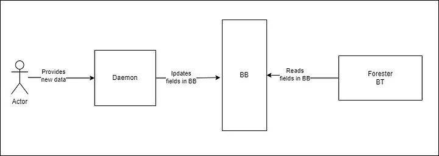
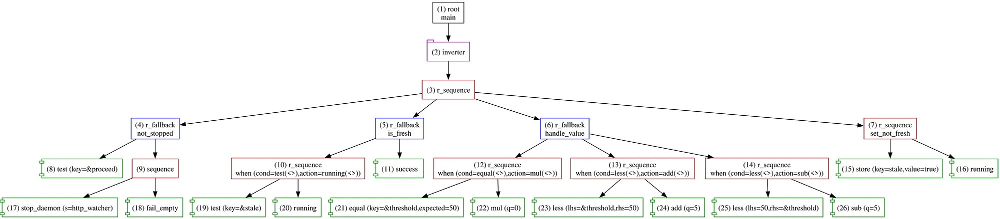

+++
title = 'Forester: Daemons for the Good — Part VI'
date = 2023-10-29T00:00:00+01:00
draft = false
tags = ['rust', 'behavior-trees', 'orchestration', 'robotics', 'daemon']
+++

# Forester: Daemons for the Good


## Intro

[Forester](https://forester-bt.github.io/forester/) is an orchestration framework that relies on behavior trees as a core concept. On top of the trees, Forester provides a set of tools to make behavior trees more flexible and powerful, including higher-order trees, tree trimming, remote actions, and more.

[Behavior trees](https://en.wikipedia.org/wiki/Behavior_tree_(artificial_intelligence,_robotics_and_control)) are a powerful tool, providing a solid foundation for a wide range of tasks.

But the framework can't operate in a vacuum. The modern infrastructure of robotic clusters is a multilayer pie where Forester can be the icing but not a replacement for solid, fast hardware processes or distributed data logistics systems.

Therefore, the ability to integrate the orchestration framework with external services becomes vital. There are also operations and tasks in the ecosystem that should be performed in the background and can't be squeezed into the trees at full throttle.

That's why this article describes **daemons** in Forester — background processes that run asynchronously alongside the tree.

## Cases?

Plenty. Here are some:

- **Subscribing to external event topics (ROS topics).**
- Subscribing to internal events (Blackboard).
- **System monitoring.**
- Cleaning operations.

Some daemons execute one small task, while others live for the entire lifetime of the tree.

## Design

*Important: daemons run in the same runtime environment as the tree, so they can directly affect its performance. Choose background functions wisely.*

Daemons can optionally have a name. The name is convenient for stopping a daemon from f-tree (via the built-in action `stop_daemon`).

The daemon interface provides a `Daemon` function that accepts a daemon context, has access to the Blackboard and Tracer, and receives a stop signal. Depending on the type, the function can be synchronous (wrapped into an async call) or asynchronous:

```rust
pub enum Daemon {
    Sync(Box<dyn DaemonFn>),
    Async(Box<dyn AsyncDaemonFn>),
}
```

**Synchronous daemon function:**

A simple function that accepts a context and a `StopFlag`, which in this case is an `Arc<AtomicBool>`:

```rust
pub trait DaemonFn: Send + Sync {
    fn perform(&mut self, ctx: DaemonContext, signal: StopFlag);
}
```

*The stop flag should be integrated into the daemon's logic to prevent hanging forever and leaking resources.*

**Asynchronous daemon function:**

```rust
pub trait AsyncDaemonFn: Send + Sync {
    fn prepare(&mut self,
               ctx: DaemonContext,
               signal: CancellationToken
    ) -> Pin<Box<dyn Future<Output=()> + Send>>;
}
```

This function is slightly more complex than its synchronous counterpart. It accepts the daemon context and a signal (in this case a Tokio cancellation token), and returns a future that will be executed. **This type is preferable for async functions.**

## Registration

Daemons can be registered in two ways.

**Using `ForesterBuilder`**

As with everything else before the tree starts, daemons can be registered:

```rust
fn register(fb: ForesterBuilder) {
    fb.register_named_daemon(
        "daemon".to_string(),
        Daemon::sync(UserDaemonSyncFn)
    );

    fb.register_daemon(Daemon::a_sync(UserAsyncDaemonFn));
}
```

**From actions using `RtEnv` directly**

The runtime environment (`rt_env`) provides a way to register daemons. *Note: registered daemons are started immediately.*

```rust
impl Impl for Action {
    fn tick(&self, args: RtArgs, ctx: TreeContextRef) -> Tick {
        let env = ctx.env().lock()?;
        env.start_daemon(Daemon::a_sync(DaemonSync), ctx.into());
        Ok(TickResult::success())
    }
}
```

## Stop

Daemons are stopped when the tree finishes. Beyond that, there are several ways to stop a daemon manually. For manual stopping, the daemon must have a name.

**Built-in action `stop_daemon`**

```f-tree
import "std::actions"
impl test();

root main sequence {
    test()
    stop_daemon("daemon")
}
```

Another built-in action related to daemons is `daemon_alive` (tests whether a daemon is running).

**From actions using `RtEnv` directly**

`RtEnv` provides a way to stop one or all daemons:

```rust
impl Impl for StopDaemonAction {
    fn tick(&self, args: RtArgs, ctx: TreeContextRef) -> Tick {
        let name = ..;
        ctx.env().lock()?.stop_daemon(&name);
        ctx.trace_ev(Event::Daemon(format!("stop {}", &name)));
        Ok(TickResult::Success)
    }
}
```

## Example

*Before anything else: the example is intentionally abstract and synthetic, serving only to demonstrate how to create and use daemons in conjunction with Forester. It could be composed in a more robust and maintainable way, but that would impair the readability of the daemon API, so the code is kept to a minimum.*

We have a tree that processes updates to certain fields in the Blackboard according to some logic. In this particular case, the tree performs arithmetic operations on the field `result` depending on the given value of `threshold`.

**But how do we update the BB fields with new values? Here we use a daemon for that. The daemon runs a simple HTTP server that accepts POST requests with new information and updates the appropriate fields in the BB.**

Schematically, the process looks like this:



### Behavior Tree

The process follows a simple algorithm:

```
Check if the flag signals to stop
  If yes, clean resources and stop the tree
  If no, proceed

Check if the data has already been processed
  If yes, this tick is done — try again next tick (start from root)
  If no, proceed

Process the data
  If threshold == 50, then result = 0
  If threshold < 50, then result = result + 5
  If threshold > 50, then result = result - 5

Set a flag that the data has been processed
`````f-tree
import "std::actions"

impl add(q:num);
impl sub(q:num);
impl mul(q:num);

root main inverter r_sequence {
    // check if the flag signals to stop the tree
    not_stopped()
    // check if we have new data
    is_fresh()
    // handle the new data
    handle_value()
    // mark the given data as stale
    set_not_fresh()
}

r_fallback not_stopped {
    // built-in action that compares a given bool with true
    test(proceed)
    sequence {
        // built-in action that stops a daemon by name
        stop_daemon("http_watcher")
        // returns empty fail
        fail_empty()
    }
}

// tests if we have fresh data and allows the flow to proceed
// or go back and try on the next tick
r_fallback is_fresh(){
    when(test(stale), running())
    success()
}

// we have new data and we need to handle it
r_fallback handle_value {
    when(equal(threshold, 50), mul(0))
    when(less(threshold, 50), add(5))
    when(less(50, threshold), sub(5))
}

// switch the flag and shove off the flow to the next tick
r_sequence set_not_fresh {
    store("stale", true)
    running()
}

// simple if(cond) { action } else { fail() }
r_sequence when(cond:tree, action:tree) {
    cond(..)
    action(..)
}
```

### The graph of the tree



### Initial BB data

```json
{
  "storage": {
    "proceed": {
      "Unlocked": true
    },
    "threshold": {
      "Unlocked": 50
    },
    "result": {
      "Unlocked": 0
    },
    "stale": {
      "Unlocked": true
    }
  }
}
```

### Arithmetic operations

```rust
pub struct Add;

impl Impl for Add {
    fn tick(&self, args: RtArgs, ctx: TreeContextRef) -> Tick {
        let result = get_result(&ctx.bb().lock()?)?;
        let value = RtValue::int(result + get_q(args)?);
        ctx.trace(format!("the result is {}", value))?;
        ctx.bb().lock()?.put(r(), value)?;

        Ok(TickResult::success())
    }
}


pub struct Sub;

impl Impl for Sub {
    fn tick(&self, args: RtArgs, ctx: TreeContextRef) -> Tick {
        let result = get_result(&ctx.bb().lock()?)?;
        let value = RtValue::int(result - get_q(args)?);
        ctx.trace(format!("the result is {}", value))?;
        ctx.bb().lock()?.put(r(), value)?;

        Ok(TickResult::success())
    }
}

pub struct Mul;

impl Impl for Mul {
    fn tick(&self, args: RtArgs, ctx: TreeContextRef) -> Tick {
        let result = get_result(&ctx.bb().lock()?)?;
        let value = RtValue::int(result * get_q(args)?);
        ctx.trace(format!("the result is {}", value))?;
        ctx.bb().lock()?.put(r(), value)?;

        Ok(TickResult::success())
    }
}
```

### HTTP daemon

```rust
pub struct HttpListener;

/// A simple daemon that listens to HTTP requests
/// and places the fields from the HTTP request into the Blackboard.
impl AsyncDaemonFn for HttpListener {
    fn prepare(
        &mut self,
        ctx: DaemonContext,
        signal: CancellationToken,
    ) -> Pin<Box<dyn Future<Output=()> + Send>> {
        Box::pin(
            async move {
                let routing = Router::new()
                    .route("/", get(|| async { "OK" }))
                    .route("/action", post(handler))
                    .with_state(ctx)
                    .into_make_service_with_connect_info::<SocketAddr>();

                axum_server::bind(SocketAddr::from(([127, 0, 0, 1], 10000)))
                    .handle(stop_srv(signal))
                    .serve(routing)
                    .await
                    .unwrap();
            }
        )
    }
}

/// Handles the request from Forester to stop the server.
fn stop_srv(signal: CancellationToken) -> Handle {
    let h = Handle::new();
    let handle = h.clone();
    tokio::spawn(async move {
        loop {
            tokio::select! {
                _ = signal.cancelled() => {
                    h.shutdown();
                    return;
                }
                _ = tokio::time::sleep(
                    std::time::Duration::from_millis(500)
                ) => {}
            }
        }
    });
    handle
}

#[derive(Debug, Clone, Serialize, Deserialize)]
struct Req {
    proceed: bool,
    threshold: usize,
}

async fn handler(
    State(ctx): State<DaemonContext>,
    Json(req): Json<Req>,
) -> impl IntoResponse {
    // place the fields from the HTTP request into the Blackboard
    ctx.bb
        .lock()
        .unwrap()
        .put("proceed".to_string(), RtValue::Bool(req.proceed))
        .unwrap();

    ctx.bb
        .lock()
        .unwrap()
        .put("threshold".to_string(), RtValue::int(req.threshold as i64))
        .unwrap();

    // mark the fields as new and not stale
    ctx.bb
        .lock()
        .unwrap()
        .put("stale".to_string(), RtValue::Bool(false))
        .unwrap();

    (StatusCode::OK)
}
```

The daemon expects a request like this:

```http
POST http://localhost:10000/action
Content-Type: application/json

{
  "proceed": true,
  "threshold": 50
}
```

### Compose the main file

```rust
fn main() {
    let root = root();
    let mut fb = builder(&root);

    fb.bb_load("bb_load.json".to_string());

    fb.register_sync_action("add", Add);
    fb.register_sync_action("sub", Sub);
    fb.register_sync_action("mul", Mul);

    fb.register_named_daemon(
        "http_watcher".to_string(),
        Daemon::a_sync(HttpListener),
    );

    let result = fb.build().unwrap().run();
    println!("{:?}", result);
}
```

### Run

Let's run the tree and send 4 requests to the HTTP server:

```http
POST http://localhost:10000/action
Content-Type: application/json

{
  "proceed": true,
  "threshold": 100
}
```

```http
POST http://localhost:10000/action
Content-Type: application/json

{
  "proceed": true,
  "threshold": 10
}
```

```http
POST http://localhost:10000/action
Content-Type: application/json

{
  "proceed": true,
  "threshold": 50
}
```

```http
POST http://localhost:10000/action
Content-Type: application/json

{
  "proceed": false,
  "threshold": 10
}
```

In the trace file, we can see the relevant events:

```
...
[3235]          14 : Running(cursor=1,len=2)
[3235]            custom: the result is -5
[3235]            26 : Success(q=5)
[3235]          14 : Success(cursor=1,len=2)
...
[4536]          13 : Running(cursor=1,len=2,reason=)
[4536]            custom: the result is 0
[4536]            24 : Success(q=5)
[4536]          13 : Success(cursor=1,len=2,reason=)
...
[6251]          12 : Running(cursor=1,len=2,reason=10 != 50)
[6251]            custom: the result is 0
[6251]            22 : Success(q=0)
[6251]          12 : Success(cursor=1,len=2,reason=10 != 50)
...
[8017]          9 : Running(cursor=0,len=2)
[8017]            daemon: stop http_watcher
[8017]            17 : Success(name=http_watcher)
[8017]          9 : Running(cursor=1,len=2)
```

## Conclusion

I believe daemons can be extremely useful across a variety of tasks. Moreover, there are tasks where they are irreplaceable.

Nevertheless, they bring hidden logic into the system and can be a source of resource and performance leaks, logic errors, and so on. It's best to strike a balance between visible and hidden system components — with an inclination toward the visible ones.

## Links

- [Forester](https://github.com/besok/forester)
- [Book about Forester](https://forester-bt.github.io/forester/intro.html)
- [Behavior trees](https://en.wikipedia.org/wiki/Behavior_tree_(artificial_intelligence,_robotics_and_control))
- [Sources from article](https://github.com/forester-bt/forester-examples/tree/main/daemons/simple_daemon)
- [Daemon](https://en.wikipedia.org/wiki/Daemon_(computing))