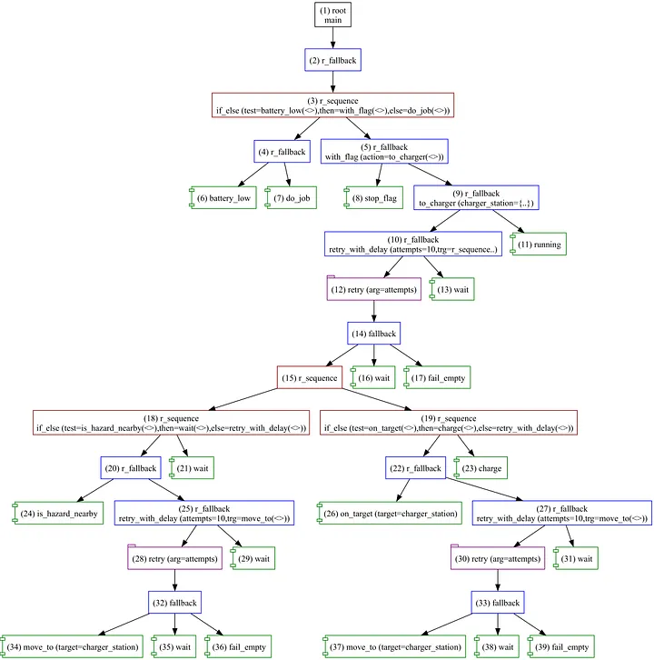

+++
title = 'Forester: The DSL Above Trees — Part II, Higher-Order Trees'
date = 2023-07-22T00:00:00+02:00
draft = false
tags = ['rust', 'behavior-trees', 'dsl', 'orchestration']
+++

## Intro

[Behavior trees](https://en.wikipedia.org/wiki/Behavior_tree_(artificial_intelligence,_robotics_and_control)) are a mathematical model used to execute complex flows. [Forester](https://github.com/besok/forester) is an orchestration framework that operates on top of behavior trees, providing a clean and simple way to run tasks that implement the behavior tree concept out of the box.

Although the core concept under the hood is behavior trees, the framework also provides a DSL called **f-tree**, which compiles into the trees.

This article sheds some light on why and how f-tree can be useful, especially when it comes to code deduplication.

The [language](https://forester-bt.github.io/forester/intro_lang.html) itself is fairly simple and can be explored quickly.

A few features that motivated the creation of the language:

- **Imports** allow breaking large scripts into separate files.
- **Definitions** allow isolating and deduplicating parts of the logic.
- **Messages** allow passing data between invocations.
- **Higher-order definitions** allow building an abstract layer to handle complex logic.

That last point is the interesting one. Let's look at an example. The examples here are synthetic, but they demonstrate the reasoning behind specific language components.

## Example

Let's model a case where an [AMR](https://en.wikipedia.org/wiki/Mobile_robot) needs to do a job but must first ensure its charge level stays consistently above a minimum.

The process needs to fulfill a set of conditions:

- check the battery level, and if it's low, head to the charging station
- watch for obstacles or other hazards nearby
- respect a flag to stop everything
- start charging upon arrival

There's not much to do, but the steps require checking various conditions at each step — some of which overlap. On top of that, the common logic needs to interact with external events like `stop_flag` and others.

F-tree aims to solve this with **higher-order tree definitions** — tree definitions that can accept other tree definition instances as arguments and execute them.

The syntax is:

```f-tree
// the parameter type is tree
sequence some_tree(action:tree){
    // the form name(..) denotes the invocation of the tree
    action(..)
}
```

This lets us build high-level abstractions that conceal low-level logic inside. That brings several advantages:

- The definition can change while the interface stays the same.
- The definition can be documented and becomes more readable.
- The definition can provide commonly used components across projects.

On the flip side, it needs to be supported and maintained. Everything is a trade-off.

In our case, we can introduce the following definitions:

```f-tree
// Takes a target action and tries to execute it
// at least the given number of attempts,
// making a delay between attempts.
r_fallback retry_with_delay( attempts:num, trg:tree){
    retry(attempts) fallback {
        trg(..)
        wait()
    }
    // this wait is needed if we want to wait in any case.
    wait()
}

// Simple if-else.
// Since the fallback takes the condition and is sort of inverted,
// we swap the else and then trees.
r_sequence if_else(test:tree, then:tree, else:tree){
    r_fallback{
        test(..)
        else(..)
    }
    then(..)
}

// Wrapping with this definition, we can check the stop flag
// and avoid executing the given action if the flag is true (success).
r_fallback with_flag(action:tree){
    stop_flag()
    action(..)
}
```

With these small higher-order tree definitions, we can build a simple charging script:

```f-tree
// every component is reactive, so conditions are checked
// on every new tick

// charger_station is a json with coordinates
r_fallback to_charger(charger_station:object){
    // try 10 times
    retry_with_delay(10,
        // check for hazards and wait if any nearby,
        // otherwise head to the station
        r_sequence {
            if_else(
                is_hazard_nearby(),
                wait(),
                retry_with_delay(10, move_to(charger_station))
            )
            // recheck that we are at the right place,
            // and if not, go there
            if_else(
                on_target(charger_station),
                charge(),
                retry_with_delay(10, move_to(charger_station))
            )
        }
    )
    // if we reach here we need to reload again
    running()
}
```

The main definition:

```f-tree
root main r_fallback {
   // if the batteries are low, go charge; otherwise do the job
   if_else(
        test = battery_low(),
        then = with_flag(to_charger({"x":10,"y":10})),
        else = do_job()
    )
}
```

## Sources

```f-tree
import "std::actions"

cond is_hazard_nearby();
cond stop_flag();
cond battery_low();
cond on_target(target:object);

impl do_job();
impl wait();
impl move_to(target:object);
impl charge();

r_fallback retry_with_delay( attempts:num,trg:tree){
    retry(attempts) fallback {
        trg(..)
        wait()
        fail_empty()
    }
    wait()
}

r_sequence if_else(test:tree, then:tree, else:tree){
    r_fallback{
        test(..)
        else(..)
    }
    then(..)
}


r_fallback with_flag(action:tree){
    stop_flag()
    action(..)
}


r_fallback to_charger(charger_station:object){
    retry_with_delay(10,
        r_sequence {
            if_else(
                is_hazard_nearby(),
                wait(),
                retry_with_delay(10, move_to(charger_station))
            )
            if_else(
                on_target(charger_station),
                charge(),
                retry_with_delay(10, move_to(charger_station))
            )
        }
    )
    running()
}


root main r_fallback {
    if_else(
        test = battery_low(),
        // don't forget about the common stop flag
        then = with_flag(to_charger({"x":10,"y":10})),
        else = do_job()
    )
}
```

## Visualization



## Conclusion

The approach is simple but can bring benefits in terms of quality and readability (or it may not — time will tell). I find it worth trying, and I believe it can ease the creation of complex trees.

## Links

- [Forester](https://github.com/besok/forester)
- [Language syntax](https://forester-bt.github.io/forester)
- [Sources from article](https://github.com/besok/forester-examples/tree/main/ho_article)
- [Behavior trees](https://en.wikipedia.org/wiki/Behavior_tree_(artificial_intelligence,_robotics_and_control))