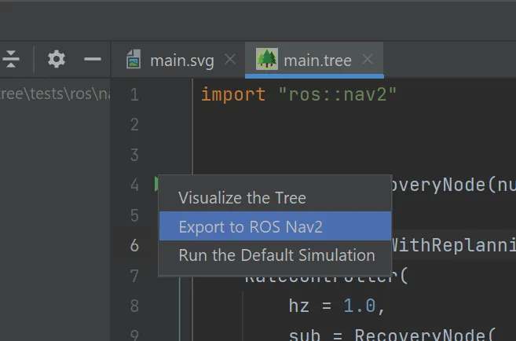
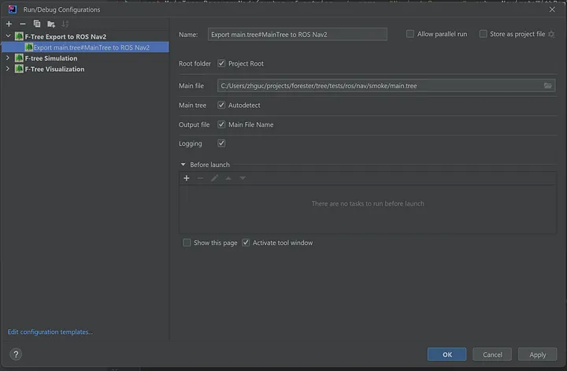
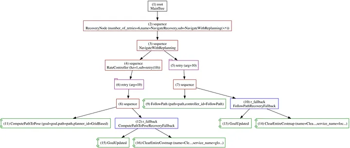

+++
title = 'Forester: Export to ROS Nav2 — Part V'
date = 2023-09-20T00:00:00+02:00
draft = false
tags = ['rust', 'behavior-trees', 'robotics', 'ros', 'navigation']
+++

# Forester: Export to ROS Nav2


## Intro

[Forester](https://forester-bt.github.io/forester/) is an orchestration framework with behavior trees at its core. On top of the trees, Forester provides a set of tools to make behavior trees more flexible and powerful, including higher-order trees, tree trimming, remote actions, and more.

[Behavior trees](https://en.wikipedia.org/wiki/Behavior_tree_(artificial_intelligence,_robotics_and_control)) are a powerful tool, providing a solid foundation for a wide range of tasks. It's no surprise that behavior trees are widely used in robotics.

On the other hand, [ROS](https://docs.ros.org/) is the de facto standard in robotics, and its brilliant [navigation module](https://navigation.ros.org/index.html) provides [behavior trees](https://navigation.ros.org/behavior_trees/index.html) as well.

This article describes the process of exporting behavior trees from Forester to the ROS Nav2 BT format. Let's look more closely at behavior trees in ROS and Forester.

## Why?

The reasons are simple:

- Forester can be more expressive in complex scenarios.
- Forester can provide extra advantages like tree trimming and remote actions in the future.

Of course, for now the reasons aren't that strong, but Forester is a young project growing fast, and the export is the simplest way to connect scripts from one framework to another.

## How?

Exporting behavior trees from Forester to ROS Nav2 BT format is straightforward. There are three ways to do it.

**Using the f-tree console utility**

```bash
f-tree nav2 -h

Options:
  -o, --output <OUTPUT>  a file for the xml. If none, the name from the main file will be used.
  -r, --root <ROOT>      a path to the root folder. <PWD> by default.
  -m, --main <MAIN>      a path to the main file. 'main.tree' by default.
  -t, --tree <TREE>      a root in the main file. If there is only one root, it is taken by default.
  -h, --help             Print help
```

All options have default values.

**Using the dedicated task in the IntelliJ plugin**


Just click on the `root` line marker and pick the option to export to ROS Nav2.

Or manually create a task:



**From Rust code using Forester as a dependency**

```rust
fn main() {
    let mut root_path = test_folder("ros/nav/smoke");
    let mut xml_file = root_path.clone();

    let project = Project::build("main.tree".to_string(), root_path).unwrap();
    let tree = RuntimeTree::build(project).unwrap().tree;

    xml_file.push("test.xml");

    tree.to_ros_nav(xml_file).unwrap();
}
```

## Import

First of all, the definitions available for export are restricted to the options listed on the [ROS Nav2 side](https://navigation.ros.org/configuration/packages/configuring-bt-xml.html).

The framework provides a specific list of ROS actions that can be imported:

```f-tree
import "ros::nav2"
```

To see the contents of the file:

```bash
f-tree -d print-ros-nav2
```

Which outputs the following (excerpt):

```f-tree
// ROS-specific actions and decorators.
// The actions are accessible using the import 'import "ros::nav2"'

// --- Control nodes ---

// PipelineSequence - a sequence of actions executed in a pipeline fashion.
// In Forester, it is represented as a sequence.

// RoundRobin - a sequence of actions executed in a round robin fashion.
// In Forester, it is represented as a fallback.

// RecoveryNode
// A control flow node with two children.
// Returns SUCCESS if and only if the first child returns SUCCESS.
// The second child is executed only if the first child returns FAILURE.
// If the second child SUCCEEDS, the first child will be executed again.
// The user can specify how many times the recovery actions should be taken
// before returning FAILURE.
// In nav2, the RecoveryNode is included in Behavior Trees to implement
// recovery actions upon failures.
// In Forester, it is represented as a decorator retry.
// There is also a specific node RecoveryNode used in nav2 Behavior Trees.


// --- Actions ---


// The RecoveryNode is a control flow node with two children.
// It returns SUCCESS if and only if the first child returns SUCCESS.
// The second child will be executed only if the first child returns FAILURE.
// If the second child SUCCEEDS, then the first child will be executed again.
// The user can specify how many times the recovery actions should be taken
// before returning FAILURE.
// In nav2, the RecoveryNode is included in Behavior Trees to implement
// recovery actions upon failures.
// <RecoveryNode number_of_retries="1">
//     <!--Add tree components here--->
// </RecoveryNode>
// Parameters:
// - input parameter: number_of_retries:num, default value: 1
// - input parameter: sub:tree
// - input parameter: name:string
sequence RecoveryNode(number_of_retries:num, sub:tree, name:string) sub(..)


// Checks if the global navigation goal has changed in the blackboard.
// Returns failure if the goal is the same; if it changes, returns success.
//
// This node differs from GoalUpdated by retaining the state of the current
// goal/goals throughout each tick of the BehaviorTree, so it will update on
// any "global" change to the goal.
// <GlobalUpdatedGoal/>
// Parameters:
// - input parameter: name:string
cond GloballyUpdatedGoal(name:string);


// Invokes the Spin ROS 2 action server, implemented by the nav2_behaviors
// module. It performs an in-place rotation by a given angle.
// Used in nav2 Behavior Trees as a recovery behavior.
// <Spin spin_dist="1.57" server_name="spin" server_timeout="10"
//   is_recovery="true" error_code_id="{spin_error_code}"/>
// Parameters:
// - input parameter: spin_dist:num, default value: 1.57
// - input parameter: time_allowance:num, default value: 10
// - input parameter: server_name:string
// - input parameter: server_timeout:num, default value: 10
// - input parameter: is_recovery:bool, default value: true
// - output parameter: error_code_id:num
// - input parameter: name:string
impl Spin(spin_dist:num, time_allowance:num, server_name:string, server_timeout:num, is_recovery:bool, error_code_id:num, name:string);

...


// Controls the tick rate for its child based on current robot speed.
// The maximum and minimum replanning rates can be supplied as parameters,
// along with maximum and minimum speed.
// Returns RUNNING when it is not ticking its child.
// In the navigation stack, SpeedController is used to adjust the rate at
// which ComputePathToPose and GoalReached nodes are ticked.
// <SpeedController min_rate="0.1" max_rate="1.0" min_speed="0.0"
//   max_speed="0.5" filter_duration="0.3">
//   <!--Add tree components here--->
// </SpeedController>
// Parameters:
// - input parameter: min_rate:num, default value: 0.1
// - input parameter: max_rate:num, default value: 1
// - input parameter: min_speed:num, default value: 0
// - input parameter: max_speed:num, default value: 0.5
// - input parameter: filter_duration:num, default value: 0.3
// - input parameter: sub:tree
// - input parameter: name:string
sequence SpeedController(min_rate:num, max_rate:num, min_speed:num, max_speed:num, filter_duration:num, sub:tree, name:string) sub(..)
```

## Notes

The control nodes map directly to the nav2 control nodes:

- `PipelineSequence` to `sequence`
- `RoundRobin` to `fallback`
- `ReactiveFallback` to `r_fallback`

If the control node has a name, it is used as the name of the control node in the nav2 tree.

```f-tree
sequence FollowPathWithFallback{
    ...
}
```

becomes in ROS Nav2:

```xml
<PipelineSequence name="FollowPathWithFallback">
...
</PipelineSequence>
```

**Retry**

The retry decorator is available with two options:

- `retry(1) ...` — transformed directly
- `RecoveryNode` — has a name or a parameter that needs to be named

**Pointers**

Pointers transform into the `"{pointer}"` format.

```f-tree
ComputePathToPose(goal = goal, path = path, planner_id = "GridBased")
```

becomes:

```xml
<ComputePathToPose goal="{goal}" path="{path}" planner_id="GridBased"/>
```

## Example

```f-tree
import "ros::nav2"

root MainTree
    RecoveryNode(
        number_of_retries = 6,
        name = "NavigateRecovery",
        sub = NavigateWithReplanning()
    )

sequence NavigateWithReplanning {
    RateController(
        hz = 1.0,
        sub = retry(10) sequence {
            ComputePathToPose(goal = goal, path = path, planner_id = "GridB")
            ComputePathToPoseRecoveryFallback()
        }
    )
    retry(10) sequence {
      FollowPath(path = path, controller_id = "FollowPath")
      FollowPathRecoveryFallback()
    }
}

r_fallback ComputePathToPoseRecoveryFallback {
    GoalUpdated()
    ClearEntireCostmap(
        name = "ClearGlobalCostmap-Context",
        service_name = "global_costmap/clear_entirely_global_costmap")
}

r_fallback FollowPathRecoveryFallback {
    GoalUpdated()
    ClearEntireCostmap(
        name = "ClearLocalCostmap-Context",
        service_name = "local_costmap/clear_entirely_local_costmap")
}
```

which transforms into:

```xml
<root main_tree_to_execute="MainTree">
  <BehaviorTree ID="MainTree">
    <RecoveryNode number_of_retries="6" name="NavigateRecovery">
      <PipelineSequence name="NavigateWithReplanning">
        <RateController hz="1">
          <RecoveryNode number_of_retries="10">
            <PipelineSequence>
              <ComputePathToPose goal="{goal}" path="{path}" planner_id="GridBased"/>
              <ReactiveFallback name="ComputePathToPoseRecoveryFallback">
                <GoalUpdated/>
                <ClearEntireCostmap name="ClearGlobalCostmap-Context" service_name="global_costmap/clear_entirely_global_costmap"/>
              </ReactiveFallback>
            </PipelineSequence>
          </RecoveryNode>
        </RateController>
        <RecoveryNode number_of_retries="10">
          <PipelineSequence>
            <FollowPath path="{path}" controller_id="FollowPath"/>
            <ReactiveFallback name="FollowPathRecoveryFallback">
              <GoalUpdated/>
              <ClearEntireCostmap name="ClearLocalCostmap-Context" service_name="local_costmap/clear_entirely_local_costmap"/>
            </ReactiveFallback>
          </PipelineSequence>
        </RecoveryNode>
      </PipelineSequence>
    </RecoveryNode>
  </BehaviorTree>
</root>
```

And the visualization (long strings omitted for clarity):



## Conclusion

This article describes the process of exporting behavior trees from Forester to the ROS Nav2 BT format. This is the first approach to integrating Forester with ROS Nav2. In the near future, Forester will provide extra tools to make the integration more flexible and powerful. For now, the next article will describe more complex examples of using Forester with ROS Nav2.

## Links

- [Forester](https://github.com/besok/forester)
- [Language syntax](https://forester-bt.github.io/forester/ros_nav2.html)
- [Behavior trees](https://en.wikipedia.org/wiki/Behavior_tree_(artificial_intelligence,_robotics_and_control))
- [Sources from article](https://github.com/forester-bt/forester-examples/tree/main/export_ros_nav)
- [ROS](https://docs.ros.org/)
- [ROS Nav2](https://navigation.ros.org/index.html)