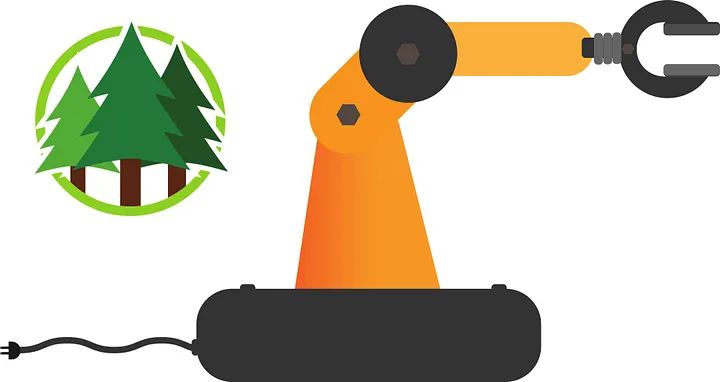
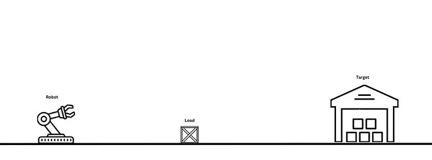

+++
title = 'Forester: A Line-Sorting Warm-Up Example'
date = 2024-04-08T00:00:00+02:00
draft = false
tags = ['rust', 'behavior-trees', 'orchestration', 'robotics']
+++

# Forester: A Line-Sorting Warm-Up Example




## Intro

[Behavior trees](https://en.wikipedia.org/wiki/Behavior_tree_(artificial_intelligence,_robotics_and_control)) are a mathematical model that helps execute complex, multi-component workflows.

[Forester](https://github.com/besok/forester) is an orchestration framework that uses behavior trees as a core concept, providing a layer above them that includes a DSL for writing trees, synchronization and asynchronous mechanisms, and more.

The interesting part is how to apply it to real problems in robotics or game design. This article gives a warm-up artificial example.

## What is given

**A line to move along.** The robot can move across the line either forward or backward.

**A robot.** It can pick up and place loads, and it moves along the line.

**A load.** The load sits on the line and can be picked up and placed by the robot.

**A target for the load.** The goal is for the robot to approach the load, pick it up, and move it to the target position.



## Easy. But how precisely?

The program accepts three coordinates (points):

- Robot position (`init_coord`)
- Load position (`load_coord`)
- Target position (`targ_coord`)

**Steps:**

1. Head off to the initial target — select the right direction and keep moving until the distance between the load and the robot becomes zero.
2. Pick up the load.
3. Move to the final point — select the right direction and keep moving until the distance between the target and the robot becomes zero.
4. Place the load.

## Let's implement it!

Here's the behavior tree:

```f-tree
import "std::actions"

root main sequence {
    define_env(
        size = 100,
        init_coord = 10,
        load_coord = 80,
        targ_coord = 0
    )
    move_to(load_coord)
    pick()
    move_to(targ_coord)
    place()
}

// initialization for the environment
sequence define_env(size:num, init:num, load:num, targ:num)
{
    store("size", size)
    store("init_coord", init)
    store("curr_coord", init)
    store("direction", 0)
    store("load_coord", load)
    store("targ_coord", targ)
}

// define direction and keep moving until we bump into the target
sequence move_to(target:num){
    define_direction(target)
    retry(size) {
        fallback {
            is_arrived(target)
            inverter move()
        }
    }
}

impl define_direction(target:num);
impl is_arrived(target:num);
impl move();
impl pick();
impl place();
```


The implementation details for this particular scene are hidden in the actions:

**Define direction**

Takes the current position and the target position and decides whether the robot needs to go forward (1) or backward (-1):

```rust
struct DefineDir;

impl Impl for DefineDir {
    fn tick(&self, args: RtArgs, ctx: TreeContextRef) -> Tick {
        let current = current(&ctx)?;
        let target = target(args, &ctx)?;

        if current == target {
            ctx.bb().lock()?.put("direction".to_string(), RtValue::int(0))?;
        } else if current > target {
            ctx.bb().lock()?.put("direction".to_string(), RtValue::int(-1))?;
        } else {
            ctx.bb().lock()?.put("direction".to_string(), RtValue::int(1))?;
        }

        Ok(TickResult::success())
    }
}
```

**Is arrived**

Takes the current position and the target position and compares them:

```rust
struct ArrivedCheck;

impl Impl for ArrivedCheck {
    fn tick(&self, args: RtArgs, ctx: TreeContextRef) -> Tick {
        let current = current(&ctx)?;
        let target = target(args, &ctx)?;
        ctx.trace(format!("test if current {current} and target {target} are equal"))?;
        println!("test if current {current} and target {target} are equal");
        if current == target {
            Ok(TickResult::success())
        } else {
            Ok(TickResult::failure("target and current are not eq".to_owned()))
        }
    }
}
```

**Move**

Takes the current position and direction and either adds or subtracts the needed amount:

```rust
struct Move;

impl Impl for Move {
    fn tick(&self, args: RtArgs, ctx: TreeContextRef) -> Tick {
        let b = ctx.bb();
        let mut bb = b.lock()?;
        let current = bb
            .get("curr_coord".to_owned())?
            .and_then(|v| v.clone().as_int())
            .ok_or(RuntimeError::fail("current is absent".to_owned()))?;

        let direction = bb
            .get("direction".to_owned())?
            .and_then(|v| v.clone().as_int())
            .ok_or(RuntimeError::fail("current is absent".to_owned()))?;

        let step = if direction > 0 { 1 } else if direction < 0 { -1 } else { 0 };
        let next = current + step;
        let _ = bb.put("curr_coord".to_owned(), RtValue::int(next))?;
        ctx.trace(format!("move on one step from {current} to {next}"))?;
        println!("move on one step from {current} to {next}");
        Ok(TickResult::success())
    }
}
```

**Pick and place**

Picks the load and places the load:

```rust
struct Pick;

impl Impl for Pick {
    fn tick(&self, args: RtArgs, ctx: TreeContextRef) -> Tick {
        ctx.trace("Pick load!".to_string())?;
        println!("Pick load!");
        Ok(TickResult::success())
    }
}

struct Place;

impl Impl for Place {
    fn tick(&self, args: RtArgs, ctx: TreeContextRef) -> Tick {
        ctx.trace("Place load!".to_string())?;
        println!("Place load!");
        Ok(TickResult::success())
    }
}
```

## Why?

**Transparency and separation of layers.** The actions can be reimplemented and the BT part stays the same.

**Modularity and easy implementation.** The current BT can be integrated into other BTs while keeping the same state.

## Links

- [Forester](https://github.com/besok/forester)
- [Book about Forester](https://forester-bt.github.io/learn/intro.html)
- [Behavior trees](https://en.wikipedia.org/wiki/Behavior_tree_(artificial_intelligence,_robotics_and_control))
- [Sources for article](https://github.com/forester-bt/learn/tree/main/examples/example1dtext)