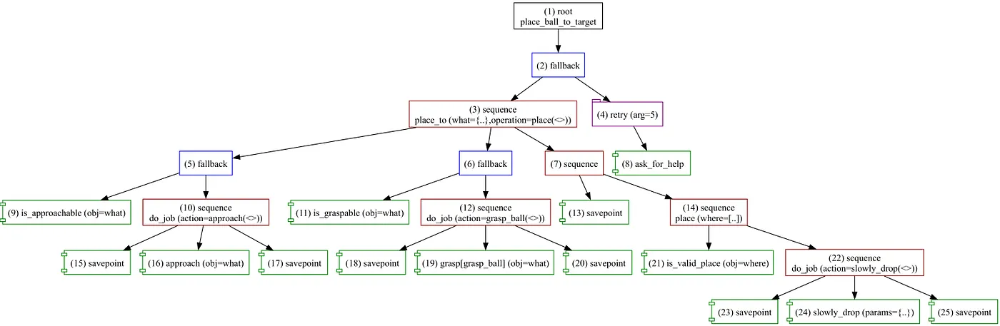
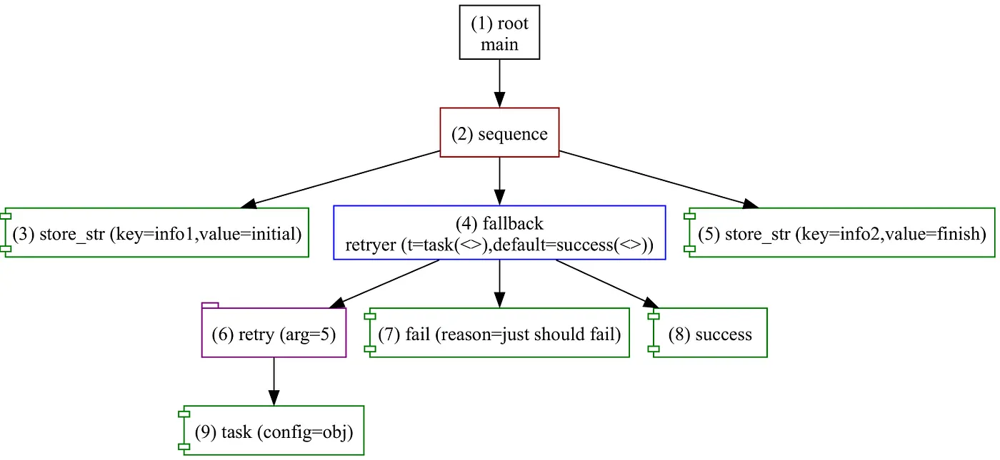

+++
title = 'Forester: Orchestration with Behavior Trees — Part I, Simulation'
date = 2023-07-17T00:00:00+02:00
draft = false
tags = ['rust', 'behavior-trees', 'dsl', 'orchestration']
+++

# Forester: Orchestration with Behavior Trees — Simulation


[Behavior trees](https://en.wikipedia.org/wiki/Behavior_tree_(artificial_intelligence,_robotics_and_control)) have become quite popular across engineering over the last several decades, especially in robotics and game design, for orchestrating and composing the logic of independent units (robots in robotics, NPCs in games, etc.).

The reason is clear: they offer a strict and understandable model that makes it easy to separate business logic from flow control. They also work with a small set of logically connected components, which makes the design easier and, in turn, relatively easy to maintain and develop.

This article is a brief introduction to [Forester](https://github.com/besok/forester) and why the game is worth the candle.

## Why Forester

First of all, [Forester](https://github.com/besok/forester) is an orchestration framework that operates on top of behavior trees.

The main idea and goal of Forester is to make the process of chaining complex logic from different tasks together effective and easy.

To that end, the framework provides a DSL above the trees, allowing you to write trees programmatically and avoid duplicating code.

The framework is written in Rust and intended to be used in a Rust environment. However, there are ways to implement trees and action behavior without writing code directly — for example, using HTTP services. Another approach is to simulate the actions of a given tree, which is what this article describes.

A detailed description of the framework is available on [GitHub](https://forester-bt.github.io/learn/).

## F-tree

The DSL is straightforward and resembles other scripting languages. It supports tree definitions, invoking definitions from other files, imports, parameters with arguments, higher-order tree definitions, and more.

Below is an example of a simple tree:

```f-tree
root place_ball_to_target fallback {
    place_to(
        what = {"x":1 },
        operation = place([10]),
    )
    retry(5) ask_for_help()
}

sequence place_to(what:object, operation:tree){
    fallback {
        is_approachable(what)
        do_job(approach(what))
    }
    fallback {
         is_graspable(what)
         do_job(grasp_ball(what))
    }
    sequence {
         savepoint()
         operation(..)
    }
}

sequence place(where:array){
    is_valid_place(where)
    do_job(slowly_drop({"cord":1}))
}

sequence do_job(action:tree){
    savepoint()
    action(..)
    savepoint()
}

cond is_approachable(obj:object);
cond is_graspable(obj:object);
cond is_valid_place(obj:object);
impl approach(obj:object);
impl grasp(obj:object);
impl ask_for_help();
impl place_to(where:array);
impl savepoint();
impl slowly_drop(params:object);
```

 

The definitions without a body are the actions that need to be implemented.

The F-tree lets you use simple tree definitions, isolate code, and reduce redundancy when creating trees.

A complete description of the language's features is available on [GitHub](https://forester-bt.github.io/learn/intro_lang.html).

## Simulation

The framework provides a simple way to test a tree independently of action implementations. This is important to ensure the logic of the tree is correct and predictable.

To start working with simulation mode, you need to install the console utility. Cargo can help with that:

```bash
cargo install f-tree
```

The framework operates with the concept of a project: it requires a **root** directory (relative imports start from the root directory) and a **main** file that contains the **root** tree definition.

By default, the main file is named **main.tree**, and if the file has only one root definition, that definition will be selected.

Let's create a simple tree. The example is synthetic, but it should be enough to demonstrate the framework's ability to provide useful information.

```f-tree
// there is an std library that provides a small set of helpers
import "std::actions"

// root definition and the entry point of the tree
root main sequence {
    // allows storing a string in the Blackboard (internal memory layer)
    store_str("info1", "initial")
    // a higher-order tree that accepts other trees as arguments
    retryer(task(config = obj), success())
    store_str("info2","finish")
}

// a simple retryer that tries to execute a given tree 5 times
// and then proceeds further if the given tree fails.
fallback retryer(t:tree, default:tree){
    // a decorator that repeats the invocation of the tree up to 5 times
    retry(5) t(..)
    // a std tree definition that always fails
    fail("just should fail")
    default(..)
}

// The action that has some business logic.
impl task(config: object);
```



Now we need to test the logic of the tree.

Create a file **main.tree** and place the code above in it.

Then create a simulation profile in that folder, let's call it **fail_sim.yaml**:

```yaml
config:
  trace: gen/main.log
  graph: gen/main.svg
  bb:
    dump: gen/bb.json
  max_ticks: 10

actions:
  -
    name: task
    stub: failure
    params:
      delay: 100
```

The `config` section denotes artifacts that will be produced during and after the execution of the tree:

- `trace`: the trace file of every step that was performed.
- `graph`: the visual representation of the tree.
- `bb.dump`: the snapshot of the Blackboard after the process finishes.
- `max_ticks`: the limit of possible ticks. This can be important when dealing with endless loops or when constrained by resources.

The `actions` section denotes how to stub the tasks that are supposed to be implemented. In the script, we have only one task to implement, called **task**. We assign the `failure` stub to it, meaning the stub will return failure after 100 milliseconds of delay.

After that, navigate to the folder from the console and run the simulation:

```bash
f-tree sim -p sim.yaml
```

Which returns:

```
[2023-07-17T19:48:16Z INFO  f_tree] the process is finished with the result: Success
```

Now head to the **gen** folder and find the following artifacts:

### Trace file `main.log`

The file shows how the tree is executed step by step, with the format:

```
[tick_number] [id] : [Status with the given arguments]
```

```
[1]  1 : Running(cursor=0,len=1)
[1]    2 : Running(cursor=0,len=3)
[1]      3 : Success(key=info1,value=initial)
[1]    2 : Running(cursor=1,len=3)
[1]      4 : Running(cursor=0,len=3)
[1]        6 : Running(len=1)
[1]          9 : Failure(config=obj,reason=)
[1]        6 : Running(arg=2,cursor=0,len=1)
[1]      4 : Running(cursor=0,len=3,prev_cursor=0)
[1]    2 : Running(cursor=1,len=3,prev_cursor=1)
[2]  next tick
[2]    2 : Running(cursor=0,len=3,prev_cursor=1)
[2]      4 : Running(cursor=0,len=3,prev_cursor=0)
[2]        6 : Running(arg=2,cursor=0,len=1)
[2]          9 : Failure(config=obj,reason=)
[2]        6 : Running(arg=3,cursor=0,len=1)
[2]      4 : Running(cursor=0,len=3,prev_cursor=0)
[2]    2 : Running(cursor=0,len=3,prev_cursor=1)
[2]  1 : Running(cursor=0,len=1)
[3]  next tick
[3]    2 : Running(cursor=0,len=3,prev_cursor=1)
[3]      4 : Running(cursor=0,len=3,prev_cursor=0)
[3]        6 : Running(arg=3,cursor=0,len=1)
[3]          9 : Failure(config=obj,reason=)
[3]        6 : Running(arg=4,cursor=0,len=1)
[3]      4 : Running(cursor=0,len=3,prev_cursor=0)
[3]    2 : Running(cursor=0,len=3,prev_cursor=1)
[3]  1 : Running(cursor=0,len=1)
[4]  next tick
[4]    2 : Running(cursor=0,len=3,prev_cursor=1)
[4]      4 : Running(cursor=0,len=3,prev_cursor=0)
[4]        6 : Running(arg=4,cursor=0,len=1)
[4]          9 : Failure(config=obj,reason=)
[4]        6 : Running(arg=5,cursor=0,len=1)
[4]      4 : Running(cursor=0,len=3,prev_cursor=0)
[4]    2 : Running(cursor=0,len=3,prev_cursor=1)
[4]  1 : Running(cursor=0,len=1)
[5]  next tick
[5]    2 : Running(cursor=0,len=3,prev_cursor=1)
[5]      4 : Running(cursor=0,len=3,prev_cursor=0)
[5]        6 : Running(arg=5,cursor=0,len=1)
[5]          9 : Failure(config=obj,reason=)
[5]        6 : Failure(arg=5,cursor=0,len=1,reason=)
[5]      4 : Running(cursor=1,len=3,prev_cursor=0)
[5]        7 : Failure(reason=just should fail)
[5]      4 : Running(cursor=2,len=3,prev_cursor=0)
[5]        8 : Success()
[5]      4 : Success(cursor=2,len=3,prev_cursor=0)
[5]    2 : Running(cursor=2,len=3,prev_cursor=1)
[5]      5 : Success(key=info2,value=finish)
[5]    2 : Success(cursor=2,len=3,prev_cursor=1)
[5]  1 : Running(cursor=0,len=1)
[5]  1 : Success(cursor=0,len=1)
```

### Visualization file `main.svg`

The framework generates an SVG visualization of the tree.



### Blackboard snapshot `bb.json`

Since we place some information in the Blackboard, it can be useful to see the final snapshot.

```json
{
  "storage": {
    "info2": {
      "Unlocked": {
        "String": "finish"
      }
    },
    "info1": {
      "Unlocked": {
        "String": "initial"
      }
    }
  }
}
```

Thus, by having two simulator profiles for success and failure cases, we can cover the execution of the tree.

**sim_fail.yaml**

```yaml
config:
  trace: gen/main_fail.trace
  graph: gen/main.svg
  bb:
    dump: gen/bb_fail.json
  max_ticks: 10

actions:
  -
    name: task
    stub: failure
    params:
      delay: 100
```

**sim_success.yaml**

```yaml
config:
  trace: gen/main_success.trace
  graph: gen/main.svg
  bb:
    dump: gen/bb_success.json
  max_ticks: 10

actions:
  -
    name: task
    stub: success
    params:
      delay: 100
```

Exceptions are beyond the scope here, but the logic can be tested easily without writing any code.

## Conclusion

The simulation process can be very useful in automation and manual scenarios — in testing, debugging, or even designing trees.

In the next chapter, we will try to implement trees using synchronous and asynchronous actions.