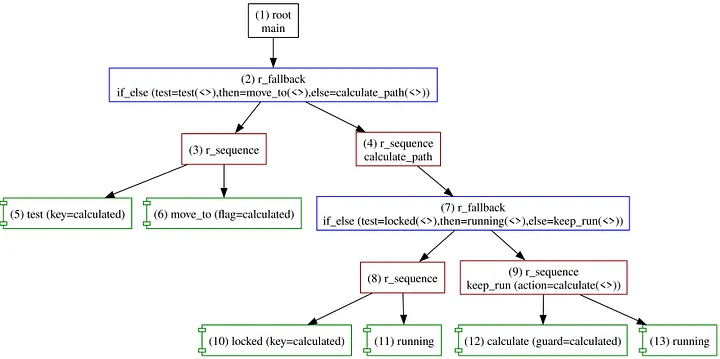

+++
title = 'Forester: Remote Actions to the Rescue! — Part IV'
date = 2023-08-24T00:00:00+02:00
draft = false
tags = ['rust', 'behavior-trees', 'orchestration', 'robotics']
+++

# Forester: Remote Actions to the Rescue!


## Intro

[Behavior trees](https://en.wikipedia.org/wiki/Behavior_tree_(artificial_intelligence,_robotics_and_control)) are a mathematical model used to execute complex flows. [Forester](https://github.com/besok/forester) is an orchestration framework that operates on top of behavior trees, providing a clean and simple way to run tasks that implement the behavior tree concept out of the box.

Although the core concept under the hood is behavior trees, the framework also provides a DSL called **f-tree**, which compiles into the trees.

One of Forester's features is the ability to run tasks remotely. Tasks can be executed on different machines — even if they are not on the same network. This is useful for a variety of applications, such as:

- Distributing tasks across multiple machines to improve performance.
- Running tasks on machines that are not accessible locally.
- Scaling applications to handle large workloads.

Forester **remote actions** are the mechanism the framework uses to run tasks remotely. A remote action is a task defined in f-tree but executed on a remote machine. The remote machine must have the Forester framework installed and be able to communicate with the local machine.

This article provides an example of how to use it in practice.

## Structure

The communication protocol is HTTP REST with JSON data passing through. It is fairly convenient and easy to trace, though the performance leaves something to be desired.

The engine provides a specific type of `Action` — namely `Action::Remote`. Details can be found in the [docs](https://forester-bt.github.io/learn/r_actions.html#remote-actions).

The library uses `reqwest` to perform a blocking POST request to the service, expecting a specific contract to be fulfilled.

On the engine side, Forester provides (needs to be instantiated separately) an integrated HTTP server with a specific API that gives access to the Blackboard and Tracer.

The sequence of steps is:

- Register remote actions in the `ForesterBuilder`, pointing to the remote actions correctly.
- Instantiate the HTTP server in the `ForesterBuilder`.
- Implement the remote actions.

## Example

For simplicity, let's assume the following case.

We have an [AMR](https://en.wikipedia.org/wiki/Mobile_robot) and need to implement a simple algorithm for moving from A (current position) to B using a map.

We pick the following sequence of steps and conditions (omitting the real implementation details, obviously):

Given a flag in the Blackboard:

- `calculated`: a boolean flag reflecting whether the path is calculated and movement is possible.

Instructions:

- If the path is not calculated, calculate the path (lock the guard while doing it, or just wait if the guard is already locked).
- If the path is calculated, proceed to the destination point.
- If something breaks the ability to continue moving, switch off the `calculated` flag, demanding a route recalculation.

It boils down to the following f-tree:

```f-tree
import "std::actions"

impl move_to(flag:string);
impl calculate(guard:string);

root main
    if_else(
        test = test("calculated"), // built-in action
        then = move_to("calculated"),
        else = calculate_path()
    )


r_sequence calculate_path
    if_else(
            locked("calculated"),
            running(),
            keep_run(calculate("calculated"))
    )

// just a wrapper to pass running
r_sequence keep_run(action:tree) {
    action(..)
    running()
}

// utility imitates if-else
r_fallback if_else(test:tree, then:tree, else:tree){
    r_sequence {
        test (..)
        then (..)
    }
    else (..)
}
```



We need to implement two actions:

- `move_to`: the action of how to move. We will implement it using the Python library provided by Forester.
- `calculate`: the action represents a planner. We will use Rust for that action.

The real implementations of moving and planning are beyond the scope of this article, so we'll stick to stubs. Also, the path coordinates are assumed to be passed implicitly.

First, the engine part:

```rust
fn main() {
    turn_on_logs();

    let mut root = root();
    let mut fb = forester_builder(&mut root);

    fb.register_remote_action(
        "calculate",
        RemoteHttpAction::new("http://localhost:10000/calculate".to_string()),
    );

    fb.register_remote_action(
        "move_to",
        RemoteHttpAction::new("http://localhost:10001/move_to".to_string()),
    );

    fb.http_serv("127.0.0.1".to_string(), 9001);

    let mut forester = fb.build().unwrap();

    println!("{:?}", forester.run_until(Some(100)));
}
```

It starts but fails instantly since the actions aren't running. *Note: unlike other actions, remote actions fail at runtime if the implementation is missing.*

Rust implementation of the planner:

```rust
#[tokio::main]
async fn main() {
    let routing = Router::new()
        .route("/", get(|| async { "OK" }))
        .route("/calculate", post(handler))
        .into_make_service();

    axum::Server::bind(&SocketAddr::from(([127, 0, 0, 1], 10000)))
        .serve(routing)
        .await
        .unwrap();
}

async fn handler(Json(req): Json<RemoteActionRequest>) -> impl IntoResponse {
    let client = ForesterClient::new(&req.serv_url).unwrap();

    client
        .put("calculated", json!(true))
        .await
        .unwrap();

    client.lock("calculated").await.unwrap();
    // imitation of the sync planning process
    tokio::time::sleep(Duration::from_millis(500)).await;

    client.unlock("calculated").await.unwrap();

    client
        .trace("Calculated", req.tick)
        .await
        .unwrap();

    (StatusCode::OK, Json(TickResult::Success))
}
```

Python implementation for `move_to`:

```python
import json
from http.server import BaseHTTPRequestHandler, HTTPServer

from forester_client_http import ForesterClient

hostName = "localhost"
serverPort = 10001


class MyServer(BaseHTTPRequestHandler):

    def do_POST(self):
        if self.path == "/move_to":
            content_length = int(self.headers["Content-Length"])
            # The body is a RemoteActionRequest:
            # {"tick": .., "args": [{"name": .., "value": ..}], "serv_url": ..}
            body = json.loads(self.rfile.read(content_length))

            tick = body["tick"]
            serv_url = body["serv_url"]

            self.send_response(200)
            self.send_header("Content-Type", "application/json;charset=UTF-8")
            self.end_headers()

            # pretend that we need to recalculate a route
            if tick == 5:
                client = ForesterClient(serv_url)
                client.put("calculated", False)
                client.trace("Bump!. Recalculate", tick)

            # at this point we arrive to the destination point
            if tick > 10:
                self.wfile.write(json.dumps("Success").encode("utf-8"))
            else:
                self.wfile.write(json.dumps("Running").encode("utf-8"))

        else:
            self.send_error(404)


if __name__ == "__main__":
    webServer = HTTPServer((hostName, serverPort), MyServer)
    print("Server started http://%s:%s" % (hostName, serverPort))

    try:
        webServer.serve_forever()
    except KeyboardInterrupt:
        pass

    webServer.server_close()
    print("Server stopped.")
```

Tracing is simple as well (insignificant parts omitted):

```
24 23:12:32.264 [1]  1 : Running(cursor=0,len=1)
24 23:12:32.266 [1]    2 : Running(cursor=0,len=2)
24 23:12:32.267 [1]      3 : Running(cursor=0,len=2)
24 23:12:32.267 [1]        5 : Failure(key=calculated,reason=false != true)
24 23:12:32.268 [1]      3 : Failure(cursor=0,len=2,reason=false != true)
24 23:12:32.269 [1]    2 : Running(cursor=1,len=2)
...
24 23:12:32.272 [1]          9 : Running(cursor=0,len=2)
24 23:12:33.523 [1]            custom: Calculating
24 23:12:34.658 [1]            custom: Calculated
24 23:12:34.661 [1]            12 : Success(guard=calculated)
24 23:12:34.661 [1]          9 : Running(cursor=1,len=2)
...
24 23:12:35.598 [5]      3 : Running(cursor=1,len=2,reason=false != true)
24 23:12:39.999 [5]        custom: Bump!. Recalculate
24 23:12:40.001 [5]        6 : Running(flag=calculated)
24 23:12:40.001 [5]      3 : Running(cursor=1,len=2,reason=false != true)
24 23:12:40.001 [5]    2 : Running(cursor=0,len=2)
24 23:12:40.002 [5]  1 : Running(cursor=0,len=1)
24 23:12:40.002 [6]  next tick
...
24 23:12:41.248 [6]            custom: Calculating
24 23:12:42.381 [6]            custom: Calculated
...
24 23:12:43.942 [11]  1 : Running(cursor=0,len=1)
24 23:12:43.942 [11]  1 : Success(cursor=0,len=1)
```

## Conclusion

Forester remote actions are a powerful way to distribute tasks across multiple machines. They can be used to improve performance, run tasks on machines that are not accessible locally, scale applications to handle large workloads, or use different technology stacks together.

## Links

- [Forester](https://github.com/besok/forester)
- [Language syntax](https://forester-bt.github.io/learn/syntax.html)
- [HTTP server](https://forester-bt.github.io/learn/engine.html#http-server)
- [Remote actions](https://forester-bt.github.io/learn/rem_action.html)
- [Sources from article](https://github.com/forester-bt/learn/tree/main/examples/remote_action/scenario)
- [Behavior trees](https://en.wikipedia.org/wiki/Behavior_tree_(artificial_intelligence,_robotics_and_control))