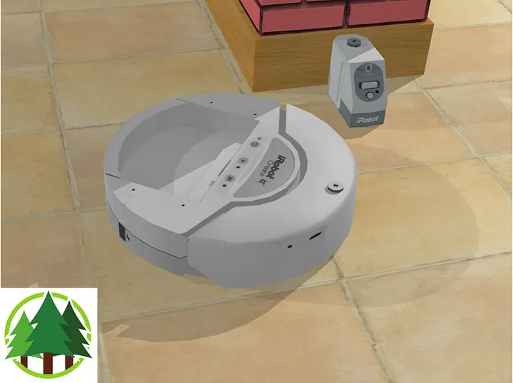
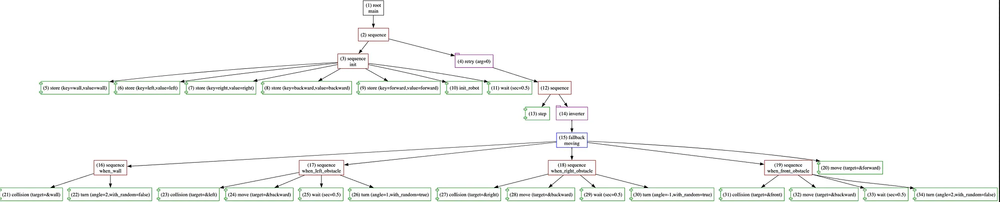
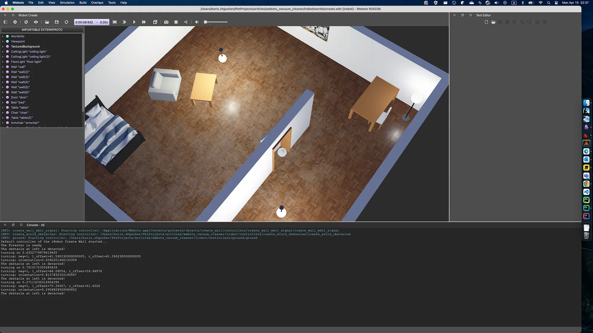
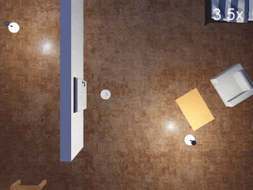

+++
title = 'Robotic Simulation with Webots and Forester on Rust'
date = 2024-04-15T00:00:00+02:00
draft = false
tags = ['rust', 'behavior-trees', 'robotics', 'webots', 'forester']
+++

# Robotic Simulation with Webots and Forester on Rust



## Intro: What is what

[**Forester**](https://github.com/forester-bt/forester) is a powerful framework built for [behavior trees](https://en.wikipedia.org/wiki/Behavior_tree_(artificial_intelligence,_robotics_and_control)). It simplifies complex BT workflows by combining tasks and offers flexibility in the execution of complex flows (timing, location). Great for AI in games, robotics, and workflow engines — and written in [Rust](https://www.rust-lang.org/).

[Webots](https://cyberbotics.com/#cyberbotics) is a robot simulation platform whose core functionality revolves around creating virtual robots and simulating their behavior in realistic environments.

Today's example demonstrates how to implement a simple algorithm for a robot vacuum cleaner using both frameworks together.

## Premises: Why use Rust and Forester with Webots?

In short: the simplicity and modularity of the orchestration logic.

- **Complex behavior made easy.** If your robot requires intricate decision-making, Forester helps manage those complexities. It lets you break down the behavior into smaller tasks within behavior trees and orchestrate them smoothly.
- **Modular and reusable code.** Building complex BTs can lead to messy code. Forester promotes modularity by allowing you to combine tasks from different BTs, making your code cleaner and easier to reuse across robot behaviors.
- **Flexibility for different scenarios.** Forester gives you control over how tasks within BTs are executed. This is crucial in robot simulations, where you might want some actions to happen simultaneously (e.g., moving while sensing the environment) and others sequentially (e.g., navigating an obstacle course).
- **Blazingly fast recompilation.** The BT scripts do not require recompilation of the rest of the program (Rust or C).

## The task description

Let's take a simple example of the [iRobot Create robot](https://www.cyberbotics.com/doc/guide/create?version=R2021a) — a customizable frame based on the famous Roomba vacuum cleaning platform, produced by iRobot. It has the following components:

- Two rotational motors (left and right)
- Several LEDs
- Two touch sensors (left and right)
- Several distance sensors
- Two position sensors
- A receiver

The simulation shows the Create robot cleaning a small apartment. The robot moves straight ahead. When hitting an obstacle or detecting a virtual wall, the robot turns randomly.

## Preparations

### Webots configuration

The Webots side consists of the `Create.proto` and `create.wbt` files, which respectively describe the robot configuration and the apartment to clean (the world).

### Rust integration

Since there is no (hopefully yet) official Rust API, we use the C API.

The library [forester-webots](https://github.com/forester-bt/forester-webots/tree/trunk) provides C bindings for the existing C API. The library wraps the unsafe blocks, sparing the user from working with unsafe code directly.

The compiled binary then needs to be copied into the appropriate location of the Webots project. For that, we use `cargo-make`:

```toml
[tasks.copy-to]
script_main = "cp target/debug/create_avoid_obstacles irobot/controllers/create_avoid_obstacles/create_avoid_obstacles"
script_post = "echo copy .../create_avoid_obstacles"
```

Everything is ready — let's get started!

## Robot implementation

The robot has a very straightforward implementation:

```rust
#[derive(Default, Debug)]
pub struct Robot {
    basic_step: Option<f64>,
    receiver: WbDeviceTag,
    leds: Vec<WbDeviceTag>,
    left_bumper: WbDeviceTag,
    right_bumper: WbDeviceTag,
    cliff_left: WbDeviceTag,
    cliff_front_left: WbDeviceTag,
    cliff_front_right: WbDeviceTag,
    cliff_right: WbDeviceTag,
    left_motor: WbDeviceTag,
    right_motor: WbDeviceTag,
    left_position_sensor: WbDeviceTag,
    right_position_sensor: WbDeviceTag,
}
```

To init devices, we invoke the C API:

```rust
pub fn init_devices(&mut self) -> RtResult<()> {
    let receiver = wb_robot_get_device("receiver");
    wb_receiver_enable(receiver, self.get_time_step());
    self.receiver = receiver;

    let leds_names = vec!["led_on", "led_play", "led_step"];

    self.leds = leds_names.iter().map(|name| wb_robot_get_device(name)).collect();

    self.left_bumper = wb_robot_get_device("bumper_left");
    self.right_bumper = wb_robot_get_device("bumper_right");

    wb_touch_sensor_enable(self.left_bumper, self.get_time_step());
    wb_touch_sensor_enable(self.right_bumper, self.get_time_step());


    self.cliff_left = wb_robot_get_device("cliff_left");
    wb_distance_sensor_enable(self.cliff_left, self.get_time_step());
    self.cliff_front_left = wb_robot_get_device("cliff_front_left");
    wb_distance_sensor_enable(self.cliff_front_left, self.get_time_step());
    self.cliff_front_right = wb_robot_get_device("cliff_front_right");
    wb_distance_sensor_enable(self.cliff_front_right, self.get_time_step());
    self.cliff_right = wb_robot_get_device("cliff_right");
    wb_distance_sensor_enable(self.cliff_right, self.get_time_step());

    self.left_motor = wb_robot_get_device("motor_left_wheel");
    self.right_motor = wb_robot_get_device("motor_right_wheel");
    wb_motor_set_position(self.left_motor, f64::INFINITY);
    wb_motor_set_position(self.right_motor, f64::INFINITY);

    wb_motor_set_velocity(self.left_motor, 0.0);
    wb_motor_set_velocity(self.right_motor, 0.0);

    self.left_position_sensor = wb_robot_get_device("left wheel sensor");
    self.right_position_sensor = wb_robot_get_device("right wheel sensor");

    wb_position_sensor_enable(self.left_position_sensor, self.get_time_step());
    wb_position_sensor_enable(self.right_position_sensor, self.get_time_step());
    Ok(())
}
```

To check collisions, we analyze the information from the sensors:

```rust
pub fn is_there_a_collision_at_left(&self) -> bool {
    wb_touch_sensor_get_value(self.left_bumper) != 0.0
}
pub fn is_there_a_collision_at_right(&self) -> bool {
    wb_touch_sensor_get_value(self.right_bumper) != 0.0
}
...
```

To move, we set the velocity on the motors:

```rust
pub fn go_forward(&self) {
    wb_motor_set_velocity(self.left_motor, 16f64);
    wb_motor_set_velocity(self.right_motor, 16f64);
}
pub fn go_backward(&self) {
    wb_motor_set_velocity(self.left_motor, -8f64);
    wb_motor_set_velocity(self.right_motor, -8f64);
}
pub fn stop(&self) {
    wb_motor_set_velocity(self.left_motor, -0f64);
    wb_motor_set_velocity(self.right_motor, -0f64);
}
```

Turning is a bit trickier but nothing special:

1. Calculate the direction and the initial position.
2. Calculate a target turn angle and set the motor velocities based on the desired direction and a speed factor.
3. Check when the angle coincides with the expected value.

```rust
pub fn turn(&mut self, angle: f64) {
    self.stop();
    let left_offset = wb_position_sensor_get_value(self.left_position_sensor);
    let right_offset = wb_position_sensor_get_value(self.right_position_sensor);
    self.step();
    let neg = if angle < 0.0 { -1.0 } else { 1.0 };
    println!("turning: neg={neg}, l_offset={left_offset}, r_offset={right_offset}");
    wb_motor_set_velocity(self.left_motor, neg * 8f64);
    wb_motor_set_velocity(self.right_motor, -neg * 8f64);

    let mut orientation = 0.0;

    while orientation < neg * angle {
        let l = wb_position_sensor_get_value(self.left_position_sensor) - left_offset;
        let r = wb_position_sensor_get_value(self.right_position_sensor) - right_offset;

        let dl = 0.031 * l;
        let dr = 0.031 * r;
        orientation = neg * (dl - dr) / 0.271756;
        self.step();
    }

    self.stop();
    self.step();
}
```

With this in place, we can implement the actions.

## Actions

In the BT we have the following actions:

```f-tree
...
// initialization operation (when we start up the sensors etc)
impl init_robot();

// waiting operation
impl wait(sec:num);

// check for collisions; target is 'wall', 'left', 'right', 'front'
impl collision(target:string);

// turning on the given angle; if the with_random flag is true, the angle is randomized
impl turn(angle:num, with_random:bool);

// moving forward, backward, or stopping
impl move(target:string);

// advance the simulation one step
impl step();
...
```

And their implementation in Rust:

**Init**

```rust
pub struct Init(pub RobotRef);

impl Impl for Init {
    fn tick(&self, args: RtArgs, ctx: TreeContextRef) -> Tick {
        ctx.trace("Rust controller of the iRobot Create robot started".to_string())?;
        ctx.trace(format!("The robot is {}", if wb_robot_init() > 0 { "ready" } else { "not ready" }))?;
        let mut robot = &mut self.0.lock()?;
        robot.init_devices();
        robot.led_on();
        ctx.trace("The devices are initialized!".to_string())?;
        Ok(TickResult::success())
    }
}
```

**Collision**

```rust
pub struct CollisionChecker(pub RobotRef);

impl Impl for CollisionChecker {
    fn tick(&self, args: RtArgs, ctx: TreeContextRef) -> Tick {
        let mut robot = &self.0.lock()?;
        let target = args
            .first()
            .and_then(|v| v.cast(ctx.clone()).str().ok())
            .flatten()
            .ok_or(RuntimeError::fail("target is absent".to_owned()))?;

        match target.as_str() {
            "wall" => {
                if robot.is_there_a_virtual_wall() {
                    ctx.trace("Virtual wall detected!".to_string())?;
                    println!("Virtual wall detected!");
                    Ok(TickResult::success())
                } else {
                    Ok(TickResult::failure("no walls here".to_string()))
                }
            }
...
            e => Err(RuntimeError::fail(format!("target is not expected {e}")))
        }
    }
}
```

**Move**

```rust
pub struct Moving(pub RobotRef);

impl Impl for Moving {
    fn tick(&self, args: RtArgs, ctx: TreeContextRef) -> Tick {
        let mut robot = &self.0.lock()?;
        let target = args
            .first()
            .and_then(|v| v.cast(ctx.clone()).str().ok())
            .flatten()
            .ok_or(RuntimeError::fail("target is absent".to_owned()))?;

        match target.as_str() {
            "forward" => {
                robot.go_forward();
                Ok(TickResult::success())
            }
...

            e => Err(RuntimeError::fail(format!("target is not expected {e}")))
        }
    }
}
```

**Turn**

```rust
pub struct Turning(pub RobotRef);

impl Impl for Turning {
    fn tick(&self, args: RtArgs, ctx: TreeContextRef) -> Tick {
        let mut robot = &mut self.0.lock()?;
        let angle = args
            .first()
            .and_then(|v| v.cast(ctx.clone()).float().ok())
            .flatten()
            .ok_or(RuntimeError::fail("angle is absent".to_owned()))?;
        let with_rand =
            args.find_or_ith("with_random".to_string(), 1)
                .and_then(|v| v.as_bool())
                .unwrap_or(false);
        let angle = if with_rand {
            let mut rng = rand::thread_rng();
            let multi: f64 = rng.gen();
            angle * multi
        } else {
            angle
        };
        println!("turning on {angle}");
        robot.turn(angle);
        Ok(TickResult::success())
    }
}
```

**Wait**

```rust
pub struct Waiting(pub RobotRef);

impl Impl for Waiting {
    fn tick(&self, args: RtArgs, ctx: TreeContextRef) -> Tick {
        let mut robot = &mut self.0.lock()?;
        let wait = args
            .first()
            .and_then(|v| v.cast(ctx.clone()).float().ok())
            .flatten()
            .ok_or(RuntimeError::fail("wait is absent".to_owned()))?;

        robot.wait(wait);
        Ok(TickResult::success())
    }
}
```

**Step**

```rust
pub struct Step(pub RobotRef);

impl Impl for Step {
    fn tick(&self, args: RtArgs, ctx: TreeContextRef) -> Tick {
        let mut robot = &mut self.0.lock()?;
        robot.flush_ir_receiver();
        robot.step();
        Ok(TickResult::success())
    }
}
```

## Behavior tree

The tree is also simple and follows a straightforward approach:

```f-tree
import "std::actions"

root main sequence {
    init()
    retry(0) sequence {
        step()
        inverter moving()
    }
}


sequence init {
    store("wall","wall")
    store("left","left")
    store("right","right")
    store("backward","backward")
    store("forward","forward")
    init_robot()
    wait(0.5)
}

fallback moving() {
    when_wall()
    when_left_obstacle()
    when_right_obstacle()
    when_front_obstacle()
    move(forward)
}

sequence when_wall {
    collision(wall)
    turn(2, false)
}
sequence when_left_obstacle {
    collision(left)
    move(backward)
    wait(0.5)
    turn(1.0, true)
}
sequence when_right_obstacle {
    collision(right)
    move(backward)
    wait(0.5)
    turn(-1.0, true)
}
sequence when_front_obstacle {
    collision(front)
    move(backward)
    wait(0.5)
    turn(2, false)
}


impl init_robot();
impl wait(sec:num);
impl collision(target:string);
impl turn(angle:num, with_random:bool);
impl move(target:string);
impl step();
```



Connecting everything inside Webots, we get the working simulation of the robot:




## Conclusion

Using Rust, Webots, and Forester together is not only possible but can be done easily, making the development process smooth and clean. Debugging is also possible with LLDB or GDB by switching to an external controller type in Webots. On the other hand, Rust provides the power and safety of a modern language for implementing individual actions, while Forester simplifies the orchestration part — all without recompiling the Rust or C components.

I would undeniably recommend giving it a try!

## Links

- [Forester](https://github.com/besok/forester)
- [Book about Forester](https://forester-bt.github.io/learn/intro.html)
- [Behavior trees](https://en.wikipedia.org/wiki/Behavior_tree_(artificial_intelligence,_robotics_and_control))
- [Webots](https://cyberbotics.com/#cyberbotics)
- [Sources](https://github.com/forester-bt/learn/tree/main/examples/webots)