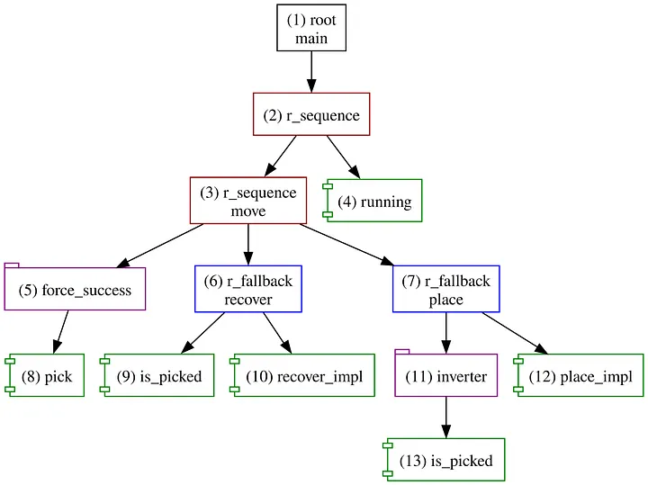
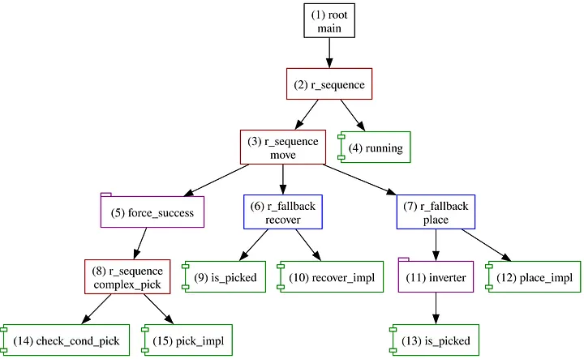
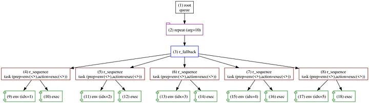
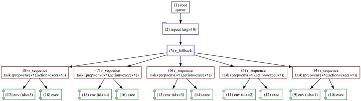

+++
title = 'Forester: Changing the Runtime Tree on the Fly — Part III, Trimming'
date = 2023-08-10T00:00:00+02:00
draft = false
tags = ['rust', 'behavior-trees', 'orchestration', 'robotics']
+++

# Forester: Changing the Runtime Tree on the Fly — Trimming


## Intro

Today, industrial robots can tackle high-complexity tasks in controlled environments, which is nothing short of inspiring.

But there's a small rub. Modern industrial applications increasingly require robots to act and orient themselves in unpredictable surroundings as well. One common way to handle this is to control the robot with a reactive policy such as [behavior trees](https://en.wikipedia.org/wiki/Behavior_tree_(artificial_intelligence,_robotics_and_control)) (BTs).

[Forester](https://github.com/besok/forester) is an orchestration framework that operates on top of behavior trees, enabling the construction of an orchestration process from scratch. It provides a clean and straightforward way to run tasks that implement the behavior tree concept out of the box.

The framework is also meant to be a practical tool — one that helps integrate new features into the broader field of BTs. This article describes a feature that allows changing the runtime tree during execution.

## Premises

*First of all, this feature is currently a low-level function that can serve as a foundation for a future API. It can be used as is, but it is cumbersome.*

The ability to change the runtime tree on the fly looks very promising from several angles:

### Performance optimizations

By analyzing the execution trace of the current tree, we can try out changes and observe how performance shifts — essentially a basis for [just-in-time compilation](https://en.wikipedia.org/wiki/Just-in-time_compilation) methods.

### Logical optimizations

Changes during execution, a shifting environment, and so on can be reasons to manually update the execution tree.

### AI optimizations

By analyzing tracing information, we can apply [machine learning](https://en.wikipedia.org/wiki/Machine_learning) methods — [reinforcement learning](https://en.wikipedia.org/wiki/Reinforcement_learning), for example.

### Experimenting with variability

We can apply changes and then roll them back to the previous state, measuring different aspects of the execution. This can be useful for discovering meta-patterns in the flow.

### Preparing changes in the environment between ticks

It can be useful to alter data in the Blackboard or perform some changes during execution.

## How it works

A short introduction to **trimming** (as defined in the framework) is available in the [book](https://forester-bt.github.io/learn/trimming.html).

Forester provides a so-called **Trimmer**, which is a queue of tasks. Between ticks, the engine pulls a task, validates it, and performs one of these actions:

- **Defers the task** — when the task tries to affect nodes that are still running, or when the task itself decides to skip this tick. In that case, the task is placed at the end of the queue.
- **Rejects the task** — if the task is inconsistent with the current tree, tries to replace the root, or decides to be rejected.
- **Applies the task** — if validation passes, Forester replaces the subtree provided by the task.

*The engine applies only one task per tick. If two tasks are queued, the first is applied in the current tick and the next only in the following tick. If a task gets deferred or rejected, the next one is pulled in the same tick.*

The structure of `TrimTask` is the following:

```rust
/// task to perform
pub enum TrimTask {
    // task that changes the runtime tree
    RtTree(Box<dyn RtTreeTrimTask>),
}

impl TrimTask {
    pub fn rt_tree<T>(task: T) -> Self
    where
        T: RtTreeTrimTask + 'static,
    {
        TrimTask::RtTree(Box::new(task))
    }

    pub fn process(&self, snapshot: TreeSnapshot<'_>) -> RtResult<TrimRequest> {
        match self {
            TrimTask::RtTree(t) => t.process(snapshot),
        }
    }
}

pub trait RtTreeTrimTask: Send {
    fn process(&self, snapshot: TreeSnapshot<'_>) -> RtResult<TrimRequest>;
}

/// represents a snapshot of the current runtime state
pub struct TreeSnapshot<'a> {
    // current tick
    pub tick: Timestamp,
    // Blackboard
    pub bb: Arc<Mutex<BlackBoard>>,
    // Tracer gives an ability to produce custom events
    pub tracer: Arc<Mutex<Tracer>>,
    pub tree: &'a RuntimeTree,
    /// from the ctx, gives the current state of every node in the tree.
    pub tree_state: &'a HashMap<RNodeId, RNodeState>,
    /// current actions. This field is important when we want to replace
    /// one action with another that is not yet in the tree and thus
    /// needs to be added manually. This field helps us check that.
    pub actions: HashSet<&'a ActionName>,
}

/// The request to proceed or not.
/// There are three possible ways:
/// defer to the next tick, reject this task entirely, or try to proceed.
#[derive(Debug)]
pub enum TrimRequest {
    /// Reject the current trim request.
    /// Useful when another request already changed the needed data.
    Reject,

    /// The conditions are not suitable for the changes.
    /// Better to wait until they improve.
    Skip,

    /// Try to proceed.
    Attempt(RequestBody),
}


/// The information to change.
pub struct RequestBody {
    /// The subtree that needs to be replaced.
    /// The major change appears in the root node of the builder;
    /// the other nodes are just supporters.
    pub tree_b: RtTreeBuilder,

    /// If we deliver a new action or change an implementation,
    /// this field helps handle it.
    /// Eventually all actions listed here will be delivered to the main tree.
    pub actions: HashMap<ActionName, Action>,
}
```

A task can be delivered to a Forester instance like this:

```rust
fn add_task(forester: &mut Forester, task: TrimTask) {
    let r: JoinHandle<RtOk> = forester.add_trim_task(task);
}
```

## Examples

The examples in this article are hypothetical and may appear artificial, but the goal is to reveal the reasoning behind the feature.

### Breaking down a long operation

Let's assume we have the following tree:

```f-tree
import "std::actions"

root main r_sequence {
    move()
    // just to have an infinite loop (reactive sequence helps here)
    running()
}

// move is a simple def that works as follows:
//   try to pick (can fail)
//   if the attempt failed, recover
//   if the attempt succeeded, place
r_sequence move() {
    // we can't predict the result of pick, so we force
    // it to always succeed
    force_success pick()
    recover()
    place()
}

r_fallback recover(){
     is_picked()
     recover_impl()
}
r_fallback place(){
     inverter is_picked()
     place_impl()
}

// checks if something is picked
impl is_picked();
// returns the robot to the pickable position
impl recover_impl();
// attempts to pick (initial implementation)
impl pick();
// attempts to place to some nearest available location
impl place_impl();
```



The script describes a way to move an item: try to pick the nearest item, and if it is picked, place it — otherwise recover to the initial position (presumably).

Let's imagine that, after analyzing the runtime execution (tracing and meta-information in the tree), we conclude that the **pick** operation is the bottleneck: it takes the lion's share of time and its result is still unpredictable (it can fail at any time). So we decide to break the current **pick** action into a subtree that first validates whether picking is possible (which can be done quickly) and then tries to pick. This can increase the chances of success or reduce time spent in failure scenarios.

**The implementation**

The real implementation is left out of the script and replaced with stubs, to focus on the mechanism of the task.

```rust
struct Breaker;

impl RtTreeTrimTask for Breaker {
    fn process(&self, snapshot: TreeSnapshot<'_>) -> RtResult<TrimRequest> {
       // simulate the analysis time
       if snapshot.tick < 5 {
            Ok(TrimRequest::Skip)
        } else {
            let tree = snapshot.tree;
            if let Some(pick_id) = tree.analyze().find_by(|n| n.is_name("pick")) {
                let mut rtb = RtTreeBuilder::new_from(tree.max_id());
                // manually, for now, create the subtree.
                let sub_tree = flow!(
                    r_sequence node_name!("complex_pick"), args!();
                        action!(node_name!("check_cond_pick")),
                        action!(node_name!("pick_impl"))
                );

                rtb.set_as_root(sub_tree, pick_id);

                // add the new actions
                let actions = HashMap::from_iter(vec![
                    (
                        "check_cond_pick".to_string(),
                        // we omit the possible real implementation here.
                        Action::sync(SimAction::Random(100)),
                    ),
                    (
                        "pick_impl".to_string(),
                        // we omit the possible real implementation here.
                        Action::sync(SimAction::Success(2000)),
                    ),
                ]);
                Ok(TrimRequest::attempt(RequestBody::new(rtb, actions)))
            } else {
                // if there is no node we need, reject the task
                Ok(TrimRequest::Reject)
            }
        }
    }
}
```



As you can see, node 8 has been replaced with a subtree that is supposed to be more effective.

It is reflected in the trace log as follows:

```
12:07:19.329 [1]  1 : Running(cursor=0,len=1)
12:07:19.330 [1]    2 : Running(cursor=0,len=2)
12:07:19.330 [1]      3 : Running(cursor=0,len=3)
...
12:07:28.747 [4]    2 : Running(cursor=1,len=2)
12:07:28.748 [4]  1 : Running(cursor=0,len=1)
12:07:28.748 [5]  next tick

12:07:28.749 [5]  trim 15 : None >>> Leaf(Name("pick_impl"), RtArgs([]))
12:07:28.749 [5]  trim 8 : Some(Leaf(Name("pick"), RtArgs([]))) >>> Flow(RSequence, Name("complex_pick"), RtArgs([]), [14, 15])
12:07:28.749 [5]  trim 14 : None >>> Leaf(Name("check_cond_pick"), RtArgs([]))

12:07:28.750 [5]    2 : Running(cursor=0,len=2)
12:07:28.750 [5]      3 : Running(cursor=0,len=3)
...
12:07:34.960 [9]    2 : Running(cursor=1,len=2)
12:07:34.961 [9]  1 : Running(cursor=0,len=1)
12:07:34.962 [10]  next tick
```

The trace shows the replacement of a node or the insertion of new nodes. Here, we perform the change task in the middle (after the 5th tick) of a 10-tick execution.

### Reordering the children

Given the following tree:

```f-tree
// a simple representation of a queue of tasks.
// the index is a shift from the head.
// the queue tries to execute the nearest task,
// and if it fails, goes to the next one, etc.
root queue
    repeat(10) r_fallback {
        task(env(1), exec())
        task(env(2), exec())
        task(env(3), exec())
        task(env(4), exec())
        task(env(5), exec())
    }

// a task consists of:
//   - a tree to prepare the environment, which can fail
//   - the task itself, which can also fail
r_sequence task(prep:tree, action:tree){
    prep(..)
    action(..)
}

// just preparing some environment: checking position, conditions, etc.
impl env(idx:num);
// executing some job
impl exec();
```



This is just a queue that executes given tasks without a specific priority. The queue tries the tasks one by one until the first success, moving forward with an increasing index that represents a shift from the initial point. Every task consists of preparing the environment and then attempting to execute it.

Let's imagine (again) that during analysis we discover that execution time and probability of success are roughly stable across tasks. But for preparation, we notice a specific pattern: the farther a task is from the original point, the less preparation time it needs. During the first part of the execution, we can measure timing for different tasks (if we're lucky) and infer that the farthest tasks can be performed more quickly.

So we decide to reorder the children of the fallback, starting from the farthest tasks. It's worth highlighting that this could be wrong if we restart the tree with new code — that would need to be checked as well.

**Here is the implementation**

```rust
struct Reorder;

impl RtTreeTrimTask for Reorder {
    fn process(&self, snapshot: TreeSnapshot<'_>) -> RtResult<TrimRequest> {
        // pretend to analyze the first part
        if snapshot.tick < 5 {
            Ok(TrimRequest::Skip)
        } else {
            let tree = snapshot.tree;

            let node = tree
                .analyze()
                .find_by(|node| node.is_flow(&FlowType::RFallback));

            if let Some(id) = node {
                let node = tree.node(&id).expect("the node should be there");
                let elems = match node {
                    RNode::Flow(_, _, _, children) => {
                        let mut children = children.clone();
                        children.reverse();
                        Ok(children)
                    }
                    _ => Err(RuntimeError::fail("recover from unexpected".to_string())),
                };
                let mut rtb = RtTreeBuilder::new();
                // here we lose the name and arguments,
                // but it is not important since we know this is an anonymous def
                rtb.set_as_root(flow!(r_fallback node_name!(), args!(), elems?), id);

                Ok(TrimRequest::attempt(RequestBody::new(
                    rtb,
                    Default::default(),
                )))
            } else {
                Ok(TrimRequest::Reject)
            }
        }
    }
}
```



Almost the same, but the order of the children is reversed.

**Here is how it is reflected in the trace log:**

```
10 12:46:00.818 [1]  1 : Running(cursor=0,len=1)
10 12:46:00.819 [1]    2 : Running(len=1)
10 12:46:00.819 [1]      3 : Running(cursor=0,len=5)
...
10 12:47:49.030 [4]  1 : Running(cursor=0,len=1)
10 12:47:49.030 [5]  next tick

10 12:47:49.031 [5]  trim 3 : Some(Flow(RFallback, Lambda, RtArgs([]), [4, 5, 6, 7, 8])) >>> Flow(RFallback, Lambda, RtArgs([]), [8, 7, 6, 5, 4])

10 12:47:49.032 [5]    2 : Running(arg=5,cursor=0,len=1)
10 12:47:49.032 [5]      3 : Running(cursor=0,len=5,reason=Tail)
10 12:47:49.033 [5]        8 : Running(cursor=0,len=2,reason=Tail)
...
10 12:48:35.298 [10]    2 : Success(arg=10,cursor=0,len=1)
10 12:48:35.298 [10]  1 : Running(cursor=0,len=1)
10 12:48:35.298 [10]  1 : Success(cursor=0,len=1)
```

## Conclusion

This feature can be a foundation for an entire layer of research, optimization, or corrections executed at runtime. It looks promising and inspiring. Of course, the approach is a bit naive in terms of handling analytical information (for now, not much information is available), but that can be improved gradually.

## Links

- [Forester](https://github.com/besok/forester)
- [Documentation](https://forester-bt.github.io/learn/trimming.html)
- [Sources from article](https://github.com/forester-bt/learn/tree/main/examples/trimming)
- [Behavior trees](https://en.wikipedia.org/wiki/Behavior_tree_(artificial_intelligence,_robotics_and_control))