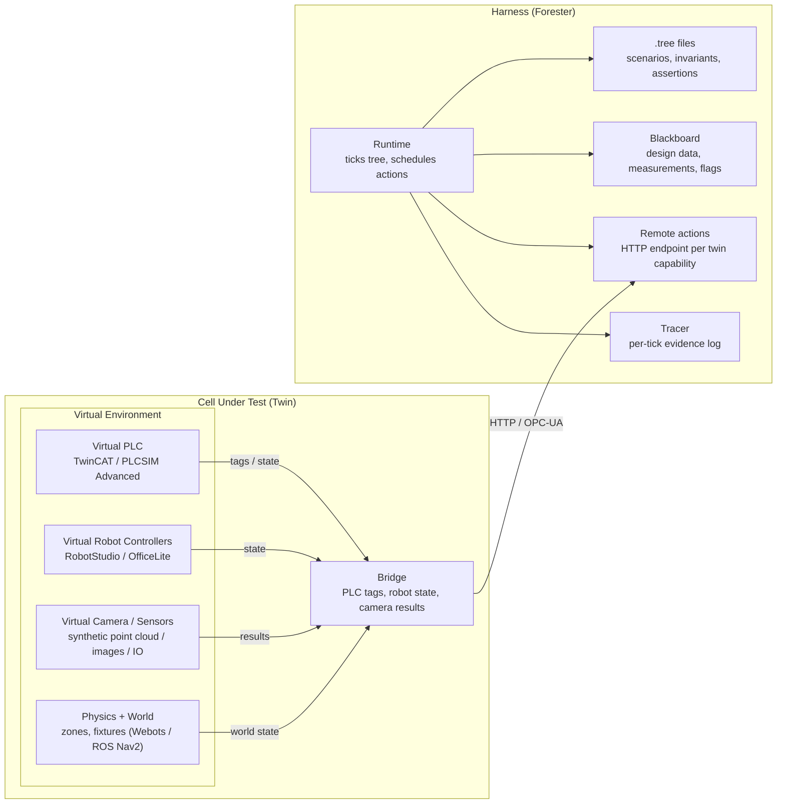

+++
title = 'Using Forester Behavior Trees for Virtual Commissioning of Robotic Cells'
date = 2026-09-10T00:00:00+02:00
draft = false
tags = ['rust', 'behavior-trees', 'forester', 'robotics', 'virtual-commissioning', 'digital-twin']
+++

# Using Forester Behavior Trees for Virtual Commissioning of Robotic Cells

## The problem

In industrial automation, we have to test extensively:

- Simulation before development. The hardware is very expensive nowadays.
- Bug fixes. If something does not work as expected, we need a virtual environment to reproduce it over and over again.
- Delivering new features. It is better to test in advance than break something that is already peacefully working.

Especially when we do not have the physical line or we want to test the software first, it is standard practice to use [Virtual Commissioning](https://virtualcommissioning.com/what-is-virtual-commissioning-2/). In simple words, it is testing the system in a simulation environment or against a [Digital Twin](https://en.wikipedia.org/wiki/Digital_twin) before tackling and debugging the real hardware.

In practice, it looks straightforward: We load the exact PLC/Robot Packages that will ship to production, point them at a simulation instead of the real hardware, and run through the test scenarios. The twin or simulation environment reacts, and the control system believes it is driving a real machine.

The main target is to find logic, timing, and interlock errors fast and without accidentally crashing a robot into a wall.

It looks simple: just prove the cell works as expected. But the challenge here is not building the environment, but rather proving the behavior matches expectations.

The main problem is covering it with test scenarios. The deeper we go, the more sophisticated scenarios we need to come up with. Most probably, the person who crafts the tests will be an industrial engineer, not a software engineer. For instance, we need to:

- Drive the cell through scenarios (normal cycle, plus every fault and recovery)
- Continuously check invariants (no collisions, correct ordering) and not just summarize at the end
- Assert outcomes (angles, positions, cycle time, alarm codes)
- Do all of it repeatably, in CI, with a trace you can attach to a FAT/SAT report

The most direct approach is to use an existing Python/C++/Rust framework that reflects the project's tech stack. Here, it starts fine but instantly gets complex and tedious, with retry loops copy-pasted everywhere, global state bugs, and invariants scattered across a hundred `if` statements. The real problem is not the simulation or environment itself, but the test orchestration.

## The role of behavior trees

A behavior tree (BT) is a small set of composable primitives such as sequence, fallback, parallel, and decorators (retry, timeout, inverter) that let you express what must happen, what must remain true, and what to try when it fails.

Forester adds three things that make BTs viable for industrial orchestration rather than just game AI:

1. A typed language and a fast Rust runtime.
2. A blackboard for shared state, with pointers into it, so values flow between steps by reference.
3. A tracer and a simulator, so a run is not just "pass/fail" but an inspectable per-tick log, and trees can be validated against a simulated robot before deployment.

The PLC keeps running its state machine. The BT runs against it.

## Components



## Layers

| Layer | What it is | Written per project? |
|---|---|---|
| **Twin** (cell under test) | Virtual PLC, robot controllers, camera/sensors, physics + world | No, off-the-shelf simulators |
| **Bridge** | Exposes PLC tags, robot state, camera results as HTTP/OPC-UA endpoints | **Yes, the only per-project code** |
| **Harness** (Forester) | `.tree` scenarios, runtime, blackboard, remote actions, tracer | No, configuration only |

## The example

There is a given cell. Robot A places battens from a feeder onto a board; Robot B staples them. Both arms reach a shared interference zone above the board, arbitrated by a PLC zone-mutex (Request/Grant per arm). A top camera verifies placement. The PLC is the cell master.

Test scenarios:

1. No collisions: when one arm places, the other waits or staples a previous batten, and vice versa.
2. Stapling only on placed battens: ordering.
3. Camera: angles are only 0° or 90° (no skew).
4. Total mission time ≤ X.
5. Camera: positions match the design.

The tree stimulates scenarios and checks invariants. The logic of the particular steps is moved to the level of either the bridge or the PLC itself.

```f-tree
import "std::actions"

// ---- the VC suite (in reality, it is slightly bigger) ----

root main sequence {
    cell_setup()
    scenario("production_cycle",        production_cycle())
    scenario("magazine_empty_recovery", magazine_empty_recovery())
    scenario("vision_no_read_recovery", vision_no_read_recovery())
    scenario("dropped_batten_recovery", dropped_batten_recovery())
}

sequence cell_setup() {
    plc_write("Cell.Mode", "AUTO") // init command

    // wait until it sets up
    retry_until(20, 500, parallel {
        auto_mode()
        safety_ok()
    })

    // wait until it starts
    retry_until(30, 500, cell_running())
}

// One full board. The PLC drives; the tree guards the invariants
// reactively (fail + halt the instant one breaks) then asserts results.
sequence production_cycle() {
    cycle_start()
    retry_until(20, 250, cell_running())

    r_fallback {
        r_sequence {
            inverter zone_mutex_violation()   // control layer
            inverter both_arms_in_zone()      // physics layer
            retry_until(50, 500, cycle_done())
        }
        fail("SAFETY INVARIANT VIOLATED")
    }

    for_battens(8, "i", sequence {
        stapled_implies_placed(i)   // ordering
        batten_stapled(i)           // completeness
    })
    plc_read("KPI.CycleTimeMs", "cycle_ms")
    less(cycle_ms, 45000)           // takt-time budget
    no_alarm_active()
    camera_qa()
}

sequence camera_qa() {
    for_battens(8, "i", sequence {
        camera_trigger(i, "meas")
        fallback {
            angle_is_0(i)
            angle_is_90(i)
        }
        batten_position_ok(i)
    })
}

sequence magazine_empty_recovery() {
    cycle_start()
    retry_until(20, 250, cell_running())
    fault_inject({"type": "STAPLE_MAGAZINE_EMPTY"})
    retry_until(10, 500, alarm_active("STAPLER_MAG_EMPTY"))
    reload_magazine()
    ack_alarm()
    retry_until(10, 500, cell_running())
    retry_until(50, 500, cycle_done())
    no_alarm_active()
}

sequence vision_no_read_recovery() {
    cycle_start()
    retry_until(20, 250, cell_running())
    fault_inject({"type": "VISION_NO_READ"})
    retry_until(10, 500, alarm_active("VISION_NO_READ"))
    fault_inject({"type": "VISION_CLEAR"})
    ack_alarm()
    retry_until(50, 500, cycle_done())
    camera_qa()
}

sequence dropped_batten_recovery() {
    cycle_start()
    retry_until(20, 250, cell_running())
    fault_inject({"type": "BATTEN_DROPPED"})
    retry_until(10, 500, alarm_active("GRIPPER_LOST_PART"))
    ack_alarm()
    retry_until(50, 500, cycle_done())
    for_battens(8, "i", stapled_implies_placed(i))
    camera_qa()
}

// ---- reusable patterns (higher-order trees) ----

fallback retry_until(attempts:num, every_ms:num, t:tree) {
    retry(attempts) fallback {
        t(..)
        wait(every_ms)
        fail_empty()
    }
    fail("retry_until: condition never became true")
}

sequence scenario(name:string, body:tree) {
    trace(["start"])
    body(..)
    trace([  "pass"])
}

sequence for_battens(n:num, idx:string, body:tree) {
    store(idx, 0)
    repeat(n) sequence {
        incr(idx, 1)
        body(..)
    }
}

// "stapled -> placed" is the implication.
sequence stapled_implies_placed(i:num) {
    fallback {
        inverter batten_stapled(i)
        batten_placed(i)
    }
}

// ---- what we OBSERVE (conditions, read from the twin) ----

impl auto_mode();
impl safety_ok();
impl cell_running();
impl cycle_done();
impl zone_mutex_violation();   // both arms granted the zone simultaneously
impl both_arms_in_zone();      // physics: both arms inside the zone AABB
impl batten_placed(i:num);
impl batten_stapled(i:num);
impl alarm_active(code:string);
impl no_alarm_active();
impl angle_is_0(i:num);
impl angle_is_90(i:num);
impl batten_position_ok(i:num);

// ---- what we STIMULATE (actions, sent to the twin) ----

impl incr(key:string, default:num);
impl plc_write(tag:string, value:any);
impl plc_read(tag:string, out:string);
impl cycle_start();
impl reload_magazine();
impl ack_alarm();
impl fault_inject(fault:object);
impl camera_trigger(batten:num, out:string);
impl wait(duration:num);
```

To run the internal [simulation](https://forester-bt.github.io/learn/sim.html), there is a simple config:

```yaml
config:
    tracer:
      file: trace.log
    graph: graph.svg
    max_ticks: 1000

actions:
    -
        name: auto_mode
        stub: success
    -
        name: safety_ok
        stub: success
    -
        name: cell_running
        stub: success
    -
        name: cycle_done
        stub: success
    -
        name: zone_mutex_violation
        stub: failure
    -
        name: both_arms_in_zone
        stub: failure
    -
        name: batten_placed
        stub: success
    -
        name: batten_stapled
        stub: success
    -
        name: alarm_active
        stub: success
    -
        name: no_alarm_active
        stub: success
    -
        name: angle_is_0
        stub: success
    -
        name: angle_is_90
        stub: success
    -
        name: batten_position_ok
        stub: success
    -
        name: incr
        stub: success
    -
        name: plc_write
        stub: success
    -
        name: plc_read
        stub: success
        bb:
          cycle_ms: 44000
    -
        name: cycle_start
        stub: success
    -
        name: reload_magazine
        stub: success
    -
        name: ack_alarm
        stub: success
    -
        name: fault_inject
        stub: success
    -
        name: camera_trigger
        stub: success
    -
        name: wait
        stub: success
        params:
            delay: 1000
```

The whole example is [here](https://github.com/forester-bt/learn/tree/main/examples/safety_testing)

## **Why this can be better than pure Rust/C++/C/Python**

Not because a BT can do anything code can't, but because it takes the parts of a harness that are repetitive, error-prone, and invisible, and makes them a small, typed, inspectable artifact:

1. Control-flow semantics are the hard part. Retry, timeout, fallback, parallel, and halting (canceling a running operation when a guard flips) are first-class and correct, instead of hand-rolled loops with edge cases.
2. It's declarative. The tree is the documentation; you can diff it, render it to SVG, and read the trace as a per-scenario verdict.
3. Reuse without copy-paste. `retry_until` and `scenario` are written once; higher-order trees eliminate the drift bugs of duplicated retry loops.
4. The blackboard kills shared-state bugs. Typed, synchronized keys replace global mutable state across threads/processes—the classic source of VC flakiness.
5. Traceability is free. Every tick, running state, and failure reason lands in the tracer, eliminating the need for a separate telemetry project.

The honest caveat: The BT pays for itself the moment you have multiple scenarios, concurrency, fault injection, and people who need to read and trust the result.

## **Considerations**

- The bridge is the risk. The HTTP/OPC-UA layer is where latency, serialization, and version skew hide. Keep the payload simple and version the endpoint contract.
- Reactive vs. step checks. Continuous invariants belong in a reactive `r_sequence`/`r_fallback`; discrete assertions belong at the scenario end.
- Simulation vs. hardware-in-the-loop. You use the same tree, but a different bridge. I keep the boundary at the action layer, never in the tree.

## **Final Thoughts**

I believe BTs can be used effectively at this level.

The test logic can be separated and handed directly to industrial engineers, with some upfront preparation, namely, packaging the higher-order trees into a reusable framework.

I see it as a perfect connection point for software and industrial engineers to collaborate on the process.
