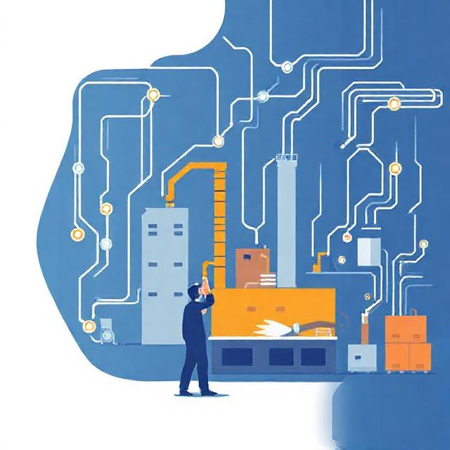

+++
title = 'Rethinking "Lights Out": What If We Architected Humans as Exception Handlers?'
date = 2026-08-09T00:00:00+01:00
draft = false
tags = ['manufacturing', 'smart-factory', 'architecture', 'hitl', 'mes']
+++

# Rethinking "Lights Out": What If We Architected Humans as Exception Handlers?




When we talk about Industry 4.0, it's hard to avoid the idea of "Lights Out Manufacturing" — the vision of fully autonomous, human-free factories where production runs endlessly in the dark.

And to be fair, I can see how that's a realistic target for certain environments. If you're working with highly predictable, uniform materials like PCB assembly, high-volume injection molding, or machining standardized metals, the physical inputs are incredibly consistent. You generally know exactly how a block of aluminum or a spool of copper wire is going to behave every single time, which means you can model those interactions almost perfectly in a digital twin. In those tightly controlled spaces, the variables are known and the materials are uniform, and I completely get why automating the human out of the loop is the ultimate goal.

But in my experience working with organic, highly variable materials like timber in construction, that "lights out" vision tends to hit an unbreakable wall when it meets physical reality.

## The Problem with Rigid Automation

What I've noticed on the floor is that when you're dealing with a warped beam, those strictly defined nailing positions we rely on in the digital model just don't map to physical reality anymore. The system expects a perfect coordinate, but the material has shifted. When a rigidly automated setup hits this discrepancy, it usually just errors out — which requires a complete reset and causes cascading line delays.

But honestly, an error state is sometimes the better scenario. The much worse reality I've seen is when the system *doesn't* error out. The discrepancy slips by completely unnoticed, and a structurally flawed assembly makes it all the way to the final quality revision — or even worse, out into the final production build.

*(As a quick note: I'm leaving the actual physical transformation out of scope here. What the operator physically does with clamps or tools to unwarp a beam is a separate discussion. My focus in this piece is strictly on the smart component of the factory — how the software architecture, specifically the Manufacturing Execution System (MES) layer, orchestrates and manages this reality.)*

## Humans as Exception Handlers

All of this got me thinking: maybe the pragmatic goal for these environments isn't to prematurely eliminate humans, but to rethink our runtime architecture.

If we think of automated execution as a `try` block, physical material variance is simply a runtime exception waiting to happen. Instead of treating a shifted beam or a failed operation as a process-ending error, what if we architected human operators directly into the control flow as **Exception Handlers**?

In a try-catch model, the overall process remains defined and predictable. The automated system executes the `try` block, but when a physical invariant breaks, control safely yields to a `catch` block — what I call an **Operator Step**. The human evaluates the exception, updates the state, and decides whether the process can safely resume or if it needs to gracefully unwind.

In modern automation terms, one way to think about this is architecting the **Human-in-the-Loop (HITL)** as **Middleware** — a dedicated integration layer that intentionally interrupts the workflow, persists the state, allows the human to intervene, and then smoothly resumes execution.

## The Operator Task: A First-Class Architectural Citizen

To really integrate human operators as exception handlers, the system shouldn't just halt and wait for a localized physical reset. Instead, the instructions sent to the machinery could include a specific, formalized **Operator Task**. This would explicitly shift the cell into manual mode and signal that control has been transferred to a human operator.

Before jumping into the specific patterns, there's a distinction worth calling out. While the heavy lifting of manipulating the graph — recalculating paths or rewriting nodes — can be automated by the system or executed by the operators, the actual kick-off should almost always be a **human decision**. Whether it's a Site Reliability Engineer monitoring the flow or an operator right there on the shop floor, triggering a graph mutation is a deliberate decision step, not just a system reaction to some event.

Keeping that in mind, when I map out these execution graphs, I usually design for three distinct patterns of human-in-the-loop orchestration:

### 1. Fault Tolerance via Step Replacement

If an automated operation fails and can't be recovered via software retries, we likely need a way to swap the automated node for a manual one. But it's important to note that this new step isn't just the old step with a "manual" flag flipped — the task fundamentally changes.

If an execution graph is structured as `[a -> b -> c]` and step `b` fails, the system could orchestrate a localized fallback to `[a -> b1 -> c]`. Here, `b1` is an explicitly new Operator Task designed to bypass the standard PLC (Programmable Logic Controller) or MES automated validations that originally failed. It replaces the initial task entirely in the graph. However, I'd highly recommend keeping a reference to the original failed step in the new task's description. This ensures the operator still has the full context of what was supposed to happen as they resolve the physical issue and signal completion, allowing the system to safely move on to step `c`.

There are other nuances worth noting here, especially when you're dealing with complex graphs that have parallelized actions.

As one possible example, let's imagine we are replacing a node in one part of the graph and we need to carefully denote or restructure the other parallel branches to keep things safe and physically viable.

Here's one way I like to visualize it. Let's say our initial execution graph involves a machine placing three timber battens simultaneously:

```
        /-> [ Place Batten 1 ] -\
[ a ] ---- [ Place Batten 2 ] ----> [ c ]
       \-> [ Place Batten 3 ] -/
```

If the automated placement for Batten 1 fails, we can't always just swap that single node for a manual task and leave the others running in parallel. Having a human in the cell while the machine is actively placing Battens 2 and 3 is a massive safety hazard.

Instead, when we mutate the graph, we might need to pull that replaced Operator Task out of the parallel block entirely. We can move the manual operation to happen *before* the split, effectively making the operator step the new split point for the remaining automated actions:

```
                                           /-> [ Place Batten 2 ] -\
[ a ] -> [ OP_Task: Place Batten 1 ] (Split)                        -> [ c ]
                                           \-> [ Place Batten 3 ] -/
```

Notice how the graph actually changes shape. We explicitly replaced the initial task with an Operator Task, but we also restructured the flow so the operator can safely resolve the physical issue first. Once they signal completion, the system takes back over to handle the remaining two battens in parallel.

Now, I'll admit, dynamically reshaping the graph on the fly like this definitely adds a layer of architectural complexity. But what I find encouraging is that this isn't exactly uncharted territory. This kind of restructuring falls neatly into classical graph theory and compiler design — areas where the rules for safely mutating execution trees and resolving dependencies are already really well understood.

Because the entire execution flow can essentially be modeled as a state machine, the actual "rewiring" of the graph can be fully automated under the hood. The operator just makes that initial human decision to trigger the manual intervention, and the system relies on those established graph rules to extract the failed node, rebuild the next valid state, and safely cue up the remaining parallel steps for when the operator finishes.

### 2. Deterministic Injection for Quality Control

Organic materials behave unpredictably. Long, thin timber items are highly prone to bending after initial processing. Because of this, I've found it helpful if the architecture supports the **deterministic injection** of manual steps into the graph for targeted quality control. After a specific phase, an Operator Step can be injected to measure, verify, and potentially trigger a rework loop before the item proceeds.

### 3. Dynamic Runtime Graph Mutation

Perhaps the most complex pattern is mutating the execution graph at runtime based on live telemetry. If sensors detect a deviation from expected tolerances, the system could automatically interrupt the workflow and inject an Operator Step. The responsibility then transfers to the operator to assess the anomaly and determine the next logical move before handing it back to the automated loop.

I tend to look at this setup as a "half-closed loop" system. It's definitely complex, mainly because you can't just have the system guessing when to interrupt. It needs to rely on clearly developed criteria for exactly how and why an intervention is supposed to happen.

From what I've seen, pulling this off also requires a really tight loop with your upstream systems. Because you're dynamically recalculating and redrawing the graph — just like we saw with the parallel batten example — you need a clear, reliable channel to initiate this recalculation and fetch the newly generated graph from the MES.

And here's a detail that I think makes or breaks this approach: that updated graph can't just be a fresh start. It has to **perfectly inherit the historical state**. Any nodes that were successfully executed prior to the interruption must be explicitly marked as "done" in the new graph. Without that state preservation, the cell coordinator might try to physically repeat steps that are already completed — which, when you're working with heavy machinery and timber, is a recipe for disaster. It introduces the same synchronization and stale-state issues we're used to dealing with in distributed systems.

Ultimately, the complexity here doesn't just sit in the math of recalculating the graph. It propagates straight into the contracts and communication patterns between the systems. Whether you lean toward a message-driven architecture or rely on flag-based states, orchestrating this kind of mid-flight change usually means designing some fairly complex handshakes just to keep the digital instructions and physical reality safely in sync.

But despite all that architectural overhead, I really believe it's incredibly beneficial in the end. Building those complex handshakes upfront is what ultimately buys you that resilience, saving you from scrapping whole assemblies or dealing with massive line downtime later.

## Handling the Irreversible Physical State

One thing worth noting is to avoid treating physical manufacturing like a database transaction. Software can roll back; timber cannot. If a machine fails halfway through a milling operation, the beam is permanently altered.

Now, the simplest way to deal with this on the floor is obviously just to replace the damaged part. But from what I've seen, that isn't always possible — maybe the part is a highly custom dimension, or there simply isn't buffer stock available at that specific station.

Because we can't always rely on a quick physical swap, I think any realistic architecture probably needs to account for this **irreversible physical state**. If an operator determines during an injected step that the material is unrecoverable and can't just be replaced, they need a way to gracefully cancel the order, logically remove the item from the execution graph, and clear the line. Otherwise, we risk starving downstream cells while they sit around waiting for a ghost order that's never going to arrive.

What's worth keeping in mind, though, is that the procedure for actually cancelling an order can't just be a manual paperwork exercise — it needs to be implemented right in the MES layer and fully automated. And I'll admit, that's a genuinely hard problem. You have to factor in real-time scheduling adjustments, buffer reallocations, and downstream impacts. Because your shop floor controls, local cells, and enterprise schedulers are typically entirely different systems, you're dealing with a deeply distributed architecture. Orchestrating a clean, automated order cancellation across that kind of distributed landscape is no small feat, but getting it right is what keeps the rest of the line from grinding to a halt.

## Operators as the "Glue" in System Evolution

Transitioning from open-loop to fully closed-loop, self-healing automation isn't just a software switch — it usually requires massive capital investment in physical telemetry like LiDAR, stereoscopic vision, or inline scanning.

An intermediate, pragmatic step, I think, is treating the human operator as the **connective tissue**. By allowing manual step injection and state overrides, operators act as the sensory and decision-making apparatus that the cell currently lacks. They perform the simple, critical validations — verifying timber orientation, checking for splits, aligning to physical stops — that allow the Manufacturing Execution System (MES) to maintain state coherence without needing a fully autonomous physical infrastructure.

## The Synchronization Problem: HMI vs. MES

Treating humans as middleware introduces a really interesting data integrity challenge. If an operator enters a cell to manually realign a bent beam, the physical reality has changed, but the **digital shadow** remains frozen in its pre-intervention state.

Relying solely on the local machine HMI often feels insufficient here, as it lacks the global context of the order and downstream dependencies. What I've seen work better is giving operators direct access to the **MES control panel** at the workstation. This allows them to view the global state, acknowledge the physical alterations, and logically update the digital shadow.

## Boundary Enforcement and ISA-95 Alignment

When an operator intervenes and the MES recalculates the execution graph, it effectively rewrites the remaining tasks.

Crucially, I believe we need to maintain a strict boundary regarding **spatial data**. The MES should probably operate entirely in product-relative coordinates (e.g., "drill 500 mm from the left edge"). It should be the sole responsibility of the local cell coordinator (PLC) to map those relative instructions to absolute machine coordinates based on the operator's manual setup.

This separation of concerns aligns nicely with the [ISA-95](https://www.isa.org/standards-and-publications/isa-standards/isa-95) (Enterprise-Control System Integration) standard. In that framework, Level 3 systems (like the MES) handle operations management and logical state tracking, while Level 1 and Level 2 systems (PLCs and local controls) manage sensing and absolute coordinate execution. Keeping exact physical millimeter offsets out of the cloud feels like the right approach here.

## Safety and the Reactive MES

To prevent race conditions and safety violations, separating cloud orchestration from local hardware seems non-negotiable. I would try to keep the **MES strictly reactive**. It receives notifications of state changes, but it shouldn't command physical motion or manage safety interlocks.

When a graph is dynamically rewritten, the digital shadow advances, but the physical re-arming of the cell remains physically isolated. The operator logically clears the state in the MES, then physically presses a hardwired resume button on the PLC to re-engage the loop.

## The Digital Twin Gap: An Open Question

While operators can bridge the immediate telemetry gap, relying on human intervention brings up an unresolved challenge I'm still working through: the **Digital Twin Gap**.

Let's say an operator uses a physical stop to align warped timber, giving the PLC a datum point to calculate absolute coordinates. The catch is that a physical stop only guarantees that single point. If the timber is warped along its entire length, aligning it to a stop doesn't give the PLC the geometric data of the warp itself. Even if the operator logically confirms "Material Aligned" in the MES, the digital twin remains partially blind to the true physical shape of the timber.

This leaves me with an open question: How do we actually address this gap? Do we need to figure out how to simulate this specific variance directly within the digital twin? Or will we eventually have to introduce rudimentary localized probing routines (like a spindle touch probe) to map the physical reality back to the logical graph after the operator steps away?

I don't have the definitive answer yet, but I don't think this unresolved gap should stop us from implementing the core concept. Deploying the operator as the connective HITL middleware feels like a solid step forward to me; solving the digital twin simulation gap is just the next puzzle to figure out.

I'd love to hear how others are tackling this. What are you seeing on the floor, and how are you bridging the gap between the digital shadow and physical reality?