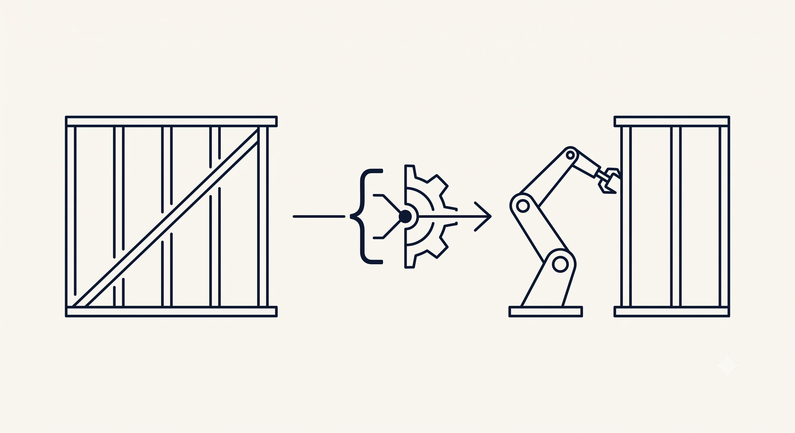

+++
title = 'Just-in-Time Compilation: A New Mental Model for the Bill of Process'
date = 2026-01-28T00:00:00+01:00
draft = false
tags = ['manufacturing', 'smart-factory', 'industry-4', 'bop', 'compilation']
+++

# Just-in-Time Compilation: A New Mental Model for the Bill of Process



## The Prediction Trap — When Variety Meets Rigidity

In the traditional manufacturing lifecycle, the flow of data is linear and comforting. It starts with a **Design** (e.g., a 3D model of a wooden wall element), which is compiled into a **Bill of Materials (BOM)** and a **Bill of Process (BOP)**.

For decades, this "waterfall" approach worked flawlessly. However, its success relied on two critical factors that are now vanishing:

### 1. The Stability of Low Variance

Historically, automation was built for repetition. In industries like automotive, the design variance was practically zero. You might have options for "Red" or "Blue," but the chassis geometry was hardcoded.

When the design is static, the BOP is static. You could spend months optimizing a single sequence because it would be repeated a million times. The "prediction" was accurate because the future was identical to the past.

### 2. The Manual Safety Net

In sectors with higher variance (like traditional carpentry), the process relied on **human supervision**. If a carpenter receives a timber frame design, they possess the **cognitive flexibility** to resolve issues in real time.

- If a beam is slightly warped, they apply physical pressure.
- If the BOP lists "Install Insulation" before "Wiring," the carpenter intuitively reorders the steps.

Humans act as real-time **exception handlers**, allowing us to assume that if a design is physically possible, it is producible.

### The Smart Factory Paradox

The moment we move to a modern Smart Factory — specifically one dealing with **high-variance production** (like unique prefabricated housing elements) — both safety nets disappear.

- **Variance explodes:** Walls and slabs are families of parametric elements. We cannot "hardcode" a sequence because we now build endless possible variances.
- **Manual flexibility vanishes:** We are sending instructions to rigid machines. A **sorting center** must know the exact orientation of an element; a **robot** cannot "squeeze" a batten that is 2mm off-tolerance.

Here lies the core conflict: We are attempting to feed **fluid designs** into **rigid automation** using the old, static BOP structures.

In this environment, the line between "What to build" (Design) and "How to build it" (Execution) becomes blurred, if not invisible.

**The Shift: The Factory as a Software Product**

To solve this, we must acknowledge a fundamental shift: **The Smart Factory is no longer just a physical asset; it is a software product.**

If we treat the factory as a programmable system, we should look to software engineering for our architectural patterns. Specifically, we should stop treating manufacturing as a logistics pipeline and start designing it like a **Compiler**.

**The Inspiration: How Compilers Work**

In computer science, a compiler is not a magic black box; it is a structured pipeline that transforms human-readable source code into machine-executable instructions.

The standard [compiler design theory](https://www.geeksforgeeks.org/compiler-design/phases-of-a-compiler/) has six distinct phases (high-level and a bit simplified):

1. **Lexical Analysis:** Converts raw source code into a sequence of meaningful tokens (keywords, identifiers).
2. **Syntax Analysis:** Verifies that the sequence of tokens follows the correct grammatical rules of the language.
3. **Semantic Analysis:** Checks whether the code makes sense logically (e.g., type checking, variable declaration).
4. **Intermediate Code Generation:** Creates a machine-independent abstraction (like a graph) that bridges high-level code and low-level execution.
5. **Code Optimization:** Improves the intermediate code to run faster or use less memory without altering functionality.
6. **Code Generation:** Translates the optimized representation into the final machine-specific instructions (Assembly/Binary).

To fix the broken link between Design and Execution in manufacturing, we must architect our data flow to mirror these exact phases.

## The First Myth — The Fallacy of Late Validation

We are witnessing a fundamental shift in industrial automation: the **Smart Factory is becoming a software product.**

To master this shift, we must stop viewing manufacturing as a simple logistics chain and start viewing the **Data Flow** as a compilation process.

In this model:

- **The Source Code:** The ERP/Design data (Human Intent).
- **The Compiler:** The MES (**Manufacturing Execution System**) + FES (**Factory Execution System**) software pipeline.
- **The Runtime Environment:** The Shopfloor — comprising the physical **Hardware** (Robots, Conveyors) and its underlying **Operating System** (PLCs, Drivers, Safety Controllers).

Our job is to architect the **Compiler** that transforms human intent into instructions that this Shopfloor OS can execute safely.

The most damaging habit in manufacturing is the belief that this transformation is a simple translation. In reality, it requires a rigorous, multi-stage validation process.

### Phase 1 & 2: Lexical and Syntax Analysis (The MES Layer)

In our architecture, the **MES** acts as the compiler's front-end. Its role is **Transformation and Domain Validation**.

When a raw design arrives from the ERP or CAD system, the MES parses it to generate the **Bill of Materials (BOM)** and **Bill of Process (BOP)**. This is not just data entry; it is the **Lexical and Syntax Analysis**:

- **Syntax Analysis (Industry Standards):** The MES validates the design against the strict "Grammar" of the industry.
- **Lexical Analysis (Resource & Planning):** It validates the tokens against the global state.

**The Output: The Saturated Document.** At the end of this phase, the raw design has been transformed into a **Metadata-Saturated BOM and BOP**. It is now a detailed, standard-compliant document.

However, just like in software, a program can be syntactically perfect and still crash the OS.

```cpp
int* buffer = new int[5];
// Syntactically valid, but writes out of bounds (UB)
buffer[6] = 42;
```

This is valid syntax. Similarly, a BOP might perfectly follow ISO standards and use available materials, but still be physically impossible for the specific **Shopfloor OS** to execute.

### Phase 3: Semantic Analysis (The FES Layer)

This is where the "Execution Gap" usually kills production. In a standard compiler, **Semantic Analysis** checks for logic errors. In our data flow, the "logic" is the **Physics** of the Runtime Environment.

- *Can the robot actually reach that nail?*
- *Does this specific board fit in the buffer?*

**The Architecture of Validation.** Here lies the trap. The MES *cannot* know these physics. If the MES knows the kinematic limits of a specific KUKA robot, we have created a **"Leaky Abstraction."**

The solution is the **validation function**. We need to provide a black box either as a module (preferably) or as a service from FES to MES.

In this architecture, the **FES** exposes a closed **Validation Function** (the Semantic Analyzer) to the MES:

1. **The Request:** The MES provides the standard-compliant BOP (*"I want to produce this wall element"*).
2. **The Semantic Check:** The FES Validation Function analyzes the request against the *current* configuration of the Shopfloor (Hardware + OS).
3. **The Result:** It returns a Pass or Fail (with reason).

Crucially, the MES remains clean. It validates the **Syntax** (Standards & Logistics), while the FES validates the **Semantics** (Physics).

### The Cost of Skipping Semantics

If we skip this phase and send the "Syntactically Correct" BOP straight to the Shopfloor OS, we encounter physical **Runtime Errors**:

- **The Surface Constraint:** The landscape of a specific wall surface does not allow the grippers to utilize all required arms. The MES saw a valid "Flip" command, but the Shopfloor OS rejects it as a physical violation.
- **The Singularity:** A nailing pattern requests a coordinate that is geometrically valid in the standard, but forces a specific robot arm into a singularity (lock-up) position.

### Moving to Intermediate Code

By enforcing **Semantic Analysis** *before* the order is released, we move from "**Late Validation**" (discovering errors on the conveyor belt) to "**Compile-Time Validation.**"

Once a design passes this check, we generate the **Intermediate Code**. This is the finalized, physically validated BOP — ready for optimization.

## The Second Myth — The Linear Sequence

We understand that we must validate the design before execution, but the question of how we store the design still holds.

In the traditional "Waterfall" model, the Bill of Process (BOP) is treated as a rigid script: *Step 1, then Step 2, then Step 3.* This is the equivalent of writing Assembly code by hand. It works, but it is brittle. If a machine changes, the script breaks.

In our "Manufacturing Compiler" architecture, the BOP is [**Intermediate Representation**](https://en.wikipedia.org/wiki/Intermediate_representation) **(IR)**.

### The BOP as Intermediate Code

In compiler design, IR is a data structure (like a [DAG](https://en.wikipedia.org/wiki/Directed_acyclic_graph), [CFG](https://en.wikipedia.org/wiki/Control-flow_graph), or [3-Address Code](https://en.wikipedia.org/wiki/Three-address_code)) that sits between the high-level source code and the machine code. It captures the *intent* and the *dependencies*, but leaves the exact execution sequence open for optimization.

Our BOP should function exactly the same way. It is not the final G-Code or PLC signal. It is a structured request that defines **Constraints**, not **Sequences**.

- **Fixed Constraints:** Some things are immutable. You must Place Board A before you can Staple Board A.
- **Flexible Opportunities:** Some things are fluid. You can drive the 50 staples on Board A in *any* order, as long as they all get done.

### The Structure of the Request

Instead of a flat list, our IR often looks like a hierarchical tree or graph. It defines *what* needs to happen, without strictly dictating *when*.

Here is a simplified JSON representation for a wall with **two boards**. Notice the following aspects:

- We define explicit predecessors and use precise float data (Quaternions) for the Shopfloor OS.
- We provide the "Naive" ordering (Place A, then Staple A, then Place B, then Staple B).

```json
{
  "Layer": "Wall_Frame_01",
  "Tasks": [
    {
      "TaskId": "T_01",
      "Description": "Place Board A",
      "Predecessors": [],
      "Steps": [
        { "Action": "Place", "Data": { "Id": "B1", "Pos": [100.0, 200.0, 0.0], "Rot": [0.0, 0.0, 0.7, 0.7] } }
      ]
    },
    {
      "TaskId": "T_02",
      "Description": "Staple Board A",
      "Predecessors": ["T_01"],
      "Steps": [
        { "Action": "Staple", "Data": { "Id": "S_01", "Pos": [105.0, 205.0, 10.0], "Rot": [0.0, 1.0, 0.0, 0.0] } },
        { "Action": "Staple", "Data": { "Id": "S_02", "Pos": [105.0, 255.0, 10.0], "Rot": [0.0, 1.0, 0.0, 0.0] } }
        /* ... hundreds more staples ... */
      ]
    },
    {
      "TaskId": "T_03",
      "Description": "Place Board B",
      "Predecessors": [],
      "Steps": [
        { "Action": "Place", "Data": { "Id": "B2", "Pos": [100.0, 800.0, 0.0], "Rot": [0.0, 0.0, 0.0, 1.0] } }
      ]
    },
    {
      "TaskId": "T_04",
      "Description": "Staple Board B",
      "Predecessors": ["T_03"],
      "Steps": [
        { "Action": "Staple", "Data": { "Id": "S_300", "Pos": [105.0, 805.0, 10.0], "Rot": [0.0, 1.0, 0.0, 0.0] } }
        /* ... hundreds more staples ... */
      ]
    }
  ]
}
```

**The Logic of Independence:**

- T_02 depends on T_01 (must place A before stapling A).
- T_04 depends on T_03 (must place B before stapling B).
- **Crucially:** T_03 (Place B) has **no predecessor**. It does not wait for T_02 to finish.

### The Backend: Just-in-Time Optimization

Because we send **IR** (Constraints) instead of **Assembly** (Scripts), the Shopfloor OS (the "Compiler Backend") can rewrite the execution path.

**1. Tool Optimization (Global Reordering)**

- *The Script Approach:* The machine follows the list blindly.
- *The Compiler Approach:* The Shopfloor OS analyzes the graph. It sees that T_03 is not blocked by T_02. It reorders the execution.

**2. Task Merging (Deep Optimization).** Once the system has grouped the stapling tasks (T_02 and T_04) together, it can perform an even deeper optimization: **Unfolding**.

- The OS merges the datasets of T_02 and T_04 into a single "super-layer" of points.
- It analyzes the geometry: if Board A and Board B abut each other, the stapling lines might be collinear.
- Instead of stapling Board A, lifting the tool, moving, and starting Board B, the robot generates a **single continuous vector path** across the seam. This eliminates the "air time" between tasks entirely, treating the separate boards as a single surface.

**3. Geometric Decomposition (Parallelization).** Now that we have a merged "super-layer," the OS can optimize for multi-robot cells.

- Instead of assigning "Task A" to Robot A and "Task B" to Robot B (which might be unbalanced), the OS analyzes the **entire merged canvas**.
- It calculates **Collision-Free Zones** dynamically. It splits the canvas spatially (e.g., Robot A takes the left 50% of points, Robot B takes the right 50%).
- Both robots work simultaneously on the same logical "task," executing a perfectly balanced workload without ever crossing into each other's safety zones.

### The Final Transformation

We started with a linear, human-readable sequence in the BOM/BOP: *Place A, Staple A, Place B, Staple B.* By the time the Shopfloor OS finished its compilation — applying Tool Optimization, Task Merging, and Geometric Decomposition — the final execution plan was radically different.

In real-world production scenarios, the final machine code often deviates from the original BOP structure by as much as **60%**.

- **60%** of the sequence was reordered, merged, or split to fit the physical reality of the moment.
- If we had tried to hardcode this sequence in the office (the "Prediction Trap" from Chapter 1), we would have either failed to execute or locked the factory into a cycle time that is **several times less efficient.**

This confirms our core architectural thesis: The Office provides the **Constraints** (IR), but only the Shopfloor can write the **Code**.

## Epilogue: The New Architectural Standard

We began with a simple observation: The "Waterfall" model of manufacturing — linear, rigid, and predictive — is failing in the face of high variance.

To build the Smart Factory, we must stop treating it as a better version of a logistics pipeline and start treating it as a **software problem**. By adopting the **Compiler Metaphor**, we gain a robust architecture for handling complexity:

1. **The Source Code (Design):** We accept that human intent is high-level and needs translation.
2. **The Front-End (MES):** We use the MES not just to pass data, but to strictly enforce **Syntax** (Standards) and **Lexical** (Resource) validity.
3. **The Semantic Check (FES):** We integrate closed **Validation Services** to ensure physical feasibility without leaking hardware complexity into the office.
4. **The Intermediate Code (BOP):** We abandon linear scripts in favor of **Dependency Graphs (IR)**, preserving the design's constraints while exposing its freedom.
5. **The Back-End (Shopfloor OS):** We trust the local hardware to perform **Just-in-Time Optimization**, rewriting the execution path for speed, tool usage, and parallelism.

This is not a distant future. It is the standard operating procedure of every software system in the world. It is time for manufacturing to catch up.

The question is no longer "How do we automate this step?" The question is: **"Is your factory running a Script, or is it running a Compiler?"**