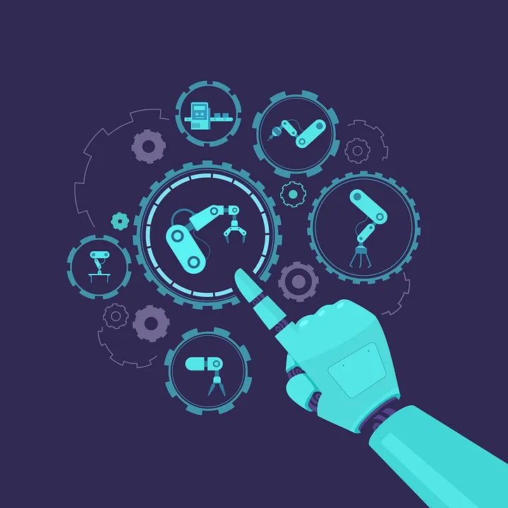

+++
title = 'The Smart Factory Paradox: Flexibility is Never Free'
date = 2026-01-07T00:00:00+01:00
draft = false
tags = ['manufacturing', 'smart-factory', 'industry-4', 'reasoning']
+++

# The Smart Factory Paradox: Flexibility is Never Free

## Introduction: The Hidden Tax on Intelligence

Building a factory — whether a new site or a major overhaul — is never truly a fresh start. We build on the shoulders of previous experience, inheriting legacies, established processes, and deep-rooted company habits. Yet in this transition, there is always a dangerous assumption that modernizing automatically means making everything "Smart."

We look at the latest trends — Autonomous Mobile Robots (AMRs), self-optimizing schedulers, AI-driven quality control — and we automatically assume this is the natural evolution of manufacturing. We treat "Intelligence" as a synonym for "Better."

But there is a conflict in this view: it ignores the fundamental law of automation: **Flexibility is not an upgrade; it is a trade-off.**

**The Cost of "Yes" truly matters.** Every time we ask a factory to be capable of saying "Yes" to a new variable — a new product shape, a sudden change in routing, a dynamic batch size — we pay a Tax on Intelligence.

**The Dumb Factory** is rigid, but it is a master of throughput. It pushes a piston every 2 seconds. It is cheap, robust, and easy to maintain because it only knows how to do one thing.

**The Smart Factory** is an engine of choice. It can handle chaos and variance. But to achieve that, it sacrifices raw speed for processing time, and it trades mechanical simplicity for software complexity.

The problem is not the technology. It is the intent. Too many organizations drift into building smart factories without realizing they are signing up for this trade-off. They layer complex digital systems over simple mechanical needs, creating facilities that are "smart" in name but fragile in operation. This is what I call **The Question of Awareness.**

The question we must answer before reviewing technical specifications is not "What technology can we afford?" but rather: **"Are we aware of the price of flexibility?"**

If we need to handle "Batch Size One" and high variance, then the cost is justified. But if we are building a smart system simply because it is the modern standard and we believe it will be faster, smarter, simpler — we are engineering our own bottleneck.

This article lays out a reasoning framework for that decision. We will look at the sequence of steps required to build a factory that balances our legacy of experience with the new demands of digitalization — ensuring we only pay for the intelligence we actually need.

## Throughput vs. Agility: The Zero-Sum Game

The first step in our reasoning framework is to define the expectations of the system. This sounds obvious, but it is where the first critical error usually occurs. Most stakeholders want a factory that is both incredibly fast and incredibly flexible. They want the speed of a bottling line with the adaptability of a craftsman's workshop.

In engineering terms, this is a contradiction. You are asking for **Throughput** (Volume/Time) and **Agility** (Variance/Time) simultaneously. While you can achieve both, the cost to do so is not linear; it is exponential.

We must accept a hard truth: **The sum of Throughput and Agility has a limit.** Imagine a slider bar. You can push the slider toward 100% Throughput, but you inevitably pull it away from Agility.

**The Concrete Wall Paradox.** To visualize this, think of a factory designed to produce concrete walls:

- **Throughput** is a continuous slip-form machine. It extrudes one long, identical grey wall at 5 meters per minute. The mold never changes, the concrete never stops pouring, and the machine never thinks. It is efficient, but you cannot put a window in it.
- **Agility** is a boutique pre-cast shop. Here, the mold is stationary. For every new order, a team of workers inserts different window frames, moves the rebar, and changes the thickness. They pour one specific wall, wait for it to cure, and then reset. It is flexible, but it produces one wall per hour.

Trying to combine them is like demanding the speed of a continuous extruder while insisting that every meter of wall has a different window placement. To make this technically possible, a simple static mold is no longer sufficient. You now require **actuated formwork** — a complex system of servo-driven plates that must adjust their position in real-time while the concrete flows.

The cost profile changes immediately. You are no longer just paying for a concrete pump; you are paying for high-precision motion control and heavy-duty actuators. The complexity increases to a point where the maintenance burden and the risk of calibration drift begin to outweigh the benefit of the speed you were trying to preserve. You have hit the **"limit in sum"** — the mechanical reality of reconfiguration eventually restricts the velocity of production.

## The Speed of "Dumb"

To understand why we pay this price, we must appreciate the elegance of the "Dumb" factory. Consider a classic mechanical production line. It is driven by a single master shaft or a tightly synchronized chain. The gripper doesn't "decide" to pick up a part; it picks it up because the cam tells it to. It doesn't need to check a database, wait for a handshake signal, or scan a barcode. It just moves.

This lack of "intelligence" is its greatest strength:

- **Latency is zero:** There is no computing time, only physics.
- **Throughput is maximum:** The parts flow in a dense, continuous stream.
- **Cost is low:** A cam is cheaper than a CPU.

If you are producing standard bricks or soda cans, this "dumb" efficiency is unbeatable. Adding sensors and decision points to this process doesn't make it faster; it only introduces the possibility of hesitation.

## The Cost of Agility

Now, let's look at a "Smart" factory. Here, the goal is Agility. We want to produce Product A, then immediately switch to Product B, or perhaps mix them on the same line.

To achieve this, we replace the mechanical cam with a servo drive and a PLC, adding sensors or — even more complex — Computer Vision (CV) modules. We replace the fixed conveyor with an intelligent routing system (like AGVs, AMRs, or magnetic shuttles). All of a sudden, every action becomes a **transaction**:

1. The product arrives at a station.
2. The sensor or CV module reads the ID.
3. The system queries the database: *"What is this?"*
4. The logic decides: *"Go left."*
5. The command is sent to the hardware.
6. The feedback is confirmed by the superior system.

Even if this happens in milliseconds (which is optimistic), it is **friction**. In a high-speed environment, these milliseconds accumulate. Furthermore, flexibility requires **buffering**. To handle different process times (e.g., Product A takes 10 seconds, Product B takes 30 seconds), you need space to park the fast products while the slow ones finish.

**The compromise is clear:** The Smart Factory gains the ability to handle variance, but it pays for it with complexity, floor space, and a lower theoretical top speed. While floor space and cycle time can be calculated with precision, the cost of complexity is harder to quantify — it can easily blow up into hundreds of engineering hours to debug a single timing issue.

## Defining the Goal

Before we discuss servers or robots, we must look at the business model and choose our lane:

**The High-Speed Self-Driving Train (Throughput Focus):** If you want maximum volume, you are building a Rail System. The efficiency comes from the **constraints**. The tracks are laid down once, and they are rigid. The train moves massive tonnage at high speed specifically *because* it cannot turn left. It has zero "steering overhead." It doesn't need to look at a map; the physics of the rails make the decision for it. It is blind, fast, and unstoppable — until a tree falls on the track, at which point the entire system halts.

**The City Self-Driving Taxi (Agility Focus):** If you want to handle any request at any time, you are managing a Taxi Fleet. The value comes from the **freedom**. You can take any passenger (product) to any specific door (station). The taxi can navigate around obstacles and change routes mid-journey. But this freedom has a tax: every intersection requires a decision. Every traffic light is a buffer. The "steering overhead" — the time spent deciding *where* to go — consumes a significant portion of the total cycle time.

A train will always beat a taxi in volume, but a taxi can go places the train cannot reach. You cannot put a train on the city streets and expect it to corner, and you cannot ask a taxi to carry 500 tons of cargo at 300 km/h.

**The Takeaway:** A factory can be dumb and profitable, or smart and profitable. But a factory that tries to be smart when it needs to be fast is just expensive.

Of course, defining the direction requires a review of the totality of factors — technical, economic, and operational. But once the intent is set, the next challenge is managing the tool that makes it all possible: the data.

## The Digitalization Trap — Virtual Friction

Once we accept the trade-off of the Zero-Sum Game, the next step is defining the digital architecture. Here, we must discard the old debate of "Paper vs. Screens." In a modern factory, everything is digital.

The real decision — and the dangerous trap — lies in the **role** of that data. We must distinguish between **Passive Digitalization** (Data as a Complement) and **Active Digitalization** (Data as a Driver).

### Level 1: Passive Digitalization (The Complement)

In a standard, high-throughput environment (the "Train"), the digital layer is thin. It acts as a complement to the physical world, helping primarily with tracking and identification.

- **The Parameter Count:** Low. We track a few static IDs, timestamps, and simple states (Pass/Fail).
- **The Logic:** The physics lead; the data follows. The machine moves the part because a sensor physically detected it. The digital system merely records *that* it happened.
- **The Reality:** The data is a logbook. If the network stutters, the conveyor keeps running. The "friction" is low because the dependency is low.

### Level 2: Active Digitalization (The Driver)

In an agile Smart Factory (the "Taxi"), we enter a new reality. We are no longer just tracking; we are **simulating in real-time**. The physical part becomes merely a shell for a complex data object living in a server — whether on-premise or in the cloud.

- **The Parameter Count:** Massive. We are tracking hundreds of changing variables: unique torque curves for *this* specific unit, dynamic routing coordinates, battery charge levels, ambient temperature offsets, and handshake tokens between five different software layers.
- **The Logic:** The data leads; the physics follow. The machine *cannot* move until the server calculates the route, validates the parameters, and authorizes the motion.
- **The Reality:** The data is the engine. If the server lags by 50ms, the robot stops.

### The Source of "Virtual Friction"

This is where the trap snaps shut. We assume that software is weightless, but in a factory, **complexity acts as friction.**

When you have a few parameters (Level 1), the system is slick and fast. When you have a high amount of changing parts (Level 2), you introduce **Virtual Friction**. Every time the machine wants to move, it must check 500 parameters against the database:

- *"Is the ID valid?"*
- *"Is the route clear?"*
- *"Is the previous station finished?"*
- *"Is the quality data uploaded?"*

If even one of these 500 digital parameters is out of sync with reality — a "ghost" pallet in the system, or a flag that wasn't reset — the physical machine hits a wall. It stops dead.

To prevent this, engineers implement extra validations, guards, and checksums. But these checks require *more* processing and *more* handshakes. This spirals the complexity and **Virtual Friction** even higher. You are no longer fighting physics; you are fighting the **bureaucracy** of your own code.

This leads to a counter-intuitive outcome: **The more data you use to drive the process, the more fragile the process becomes.**

- A "Dumb" system ignores minor data errors (it just pushes the piston).
- A "Smart" system halts for data errors (to protect the integrity of the model).

**The Strategy:** Do not apply Active Digitalization to a process that only needs Passive tracking.

- **Use Passive (Low Friction)** when the process is linear and the product is standard. Let the physics do the heavy lifting.
- **Use Active (High Friction)** only when the complexity of the *product* demands it. If you need to route every item differently, you must accept the burden of maintaining a perfect, real-time mirror of reality.

**The Takeaway:** Data is not just information; it is a constraint. The more you have, the harder it is to move.

### Rule of Thumb: The Inverse Specification

To avoid drowning in Virtual Friction, you must change how you write specifications.

Usually, engineers spend 90% of their time defining the "Happy Path" — the sequence of events when all data is perfect. **The Rule:** In a Smart Factory, you must apply the **Inverse Specification Rule**.

Spend **20%** of your time defining the function (what happens when the ID matches). Spend **80%** of your time defining the **exception handling** (what happens when it *doesn't*).

For every single digital parameter or handshake you add to the system, you must meticulously define the **"Trinity of Resilience"** in the spec:

1. **The Timeout:** How long does the machine wait for the server? (e.g., "200ms").
2. **The Retry Logic:** Does it ask again? How many times? (e.g., "Retry 3x, then Fault").
3. **The Fallback:** What is the physical behavior if the data never comes? (e.g., "Divert to Reject Lane" or "Safe Stop").

If you cannot meticulously define these three reactions for a specific data point, **do not include that data point in the control loop.** Downgrade to Level 1. A digital layer without defined failure modes is not a feature; it is a bug waiting to shut you down.

## The Hardware Fallacy — Building the Factory Twice

In traditional manufacturing, progress is measured by what you can see. If the robots are bolted to the floor and the conveyors are turning, management is happy. The "Hardware First" mentality assumes that once the machine is physically present, making it work is just a matter of "tuning."

In a Smart Factory, this is a fatal error. Why? Because the complexity lies in the **interaction** between systems. A physical machine without verified logic is effectively a statue. It looks like a factory, but it cannot think.

To mitigate this risk, we must adopt a simple philosophy: **You must build the factory twice.** First, you build it digitally (to validate the logic). Only then do you build it physically (to execute the logic).

### The Concept of Virtual Commissioning

This is not just about making a 3D animation to impress stakeholders. This is about **Virtual Commissioning (VC).**

- **Traditional Approach:** Design, Build Hardware, Write Code, Debug on Site. **The Main Problem:** You are testing your logic on real steel. If a robot arm crashes, it costs money. If the logic is flawed, you have 50 contractors standing around waiting for the programmer to fix a loop. The "Cost of Correction" is maximum.
- **Smart Approach (Shift Left):** Design, **Simulate & Emulate**, Debug in Office, Build Hardware, Download. **The Solution:** You connect the *real* PLC code to a *digital* model of the machine. You test the "Sad Path" in a virtual environment where a crash costs nothing.

### Simulation is Not Visualization

We must distinguish between a "pretty picture" and a "physics-based twin." A marketing video shows a robot moving from A to B. A **Digital Twin** includes the friction, the gravity, the sensor delays, and — most importantly — the **interface logic**. In a manual factory, you can fix a layout error with a forklift. In a smart factory, a layout error (e.g., a buffer that is 1 meter too short to hold the required 3 units) is a permanent bottleneck. You cannot "see" this error in a spreadsheet. You can only see it when you simulate 8 hours of production with 200 variance scenarios.

### The Flow Check: Discrete Event Simulation (DES)

Before we even get to Virtual Commissioning (checking the PLC code), we must pass an earlier gate: **Discrete Event Simulation.**

While Virtual Commissioning tests the *controls*, DES tests the *concept*. It ignores the physics of *how* a robot moves and focuses entirely on the logic of *when* things happen. It models the factory as a mathematical queueing system — a series of events over time.

**The "Traffic Jam" Test.** Think of it like designing a highway.

- **Virtual Commissioning** verifies that the traffic lights change color correctly when a car approaches.
- **Discrete Event Simulation** verifies that you have enough lanes so that 500 cars don't create a gridlock at 8:00 AM.

In a Smart Factory, DES is the only way to answer the expensive questions without guessing:

1. **Buffer Sizing:** *"If Station A breaks down for 5 minutes, how many meters of conveyor do I need before Station B starves?"*
2. **Fleet Management:** *"Do I need 10 AGVs or 12? What happens if they all need to charge at the same time?"*
3. **Throughput Verification:** *"Can this layout actually hit 60 parts per minute with a product mix of 50/50?"*

**The Trap of Averages.** The most dangerous mistake engineers make is using Excel to calculate throughput based on averages. *"The robot takes 10 seconds on average, so we get 6 parts per minute."* **This is a lie.** In reality, variance stacks. A slight delay in one station ripples down the line, amplified by "starving" (no parts) and "blocking" (no space) effects. Discrete Event Simulation reveals the **"Micro-Stops"** — the invisible friction that brings a theoretical 100% OEE down to a realistic 75%.

**The Rule:** You do not order a single conveyor motor until the DES model proves that the flow works under stress.

### The Hardware Entanglement

This brings us to the **Hardware Fallacy**: the belief that you pick the hardware first, and the software will adapt. In reality, the **software capability dictates the hardware choice.**

If you buy a high-speed sorter that only speaks a proprietary protocol, but your MES system requires MQTT, you have bought a brick. In the "Build Twice" model, you test this integration in the digital realm before the Purchase Order is signed.

- *Does the robot's API support the latency we defined earlier?*
- *Can the scanner trigger the divert gate fast enough in the simulation?*

If the answer is "No" in the simulation, you change the hardware selection. You do not buy the machine and hope for a software patch.

### The Paradox of Time

Here is the conflict that managers struggle with: **Virtual Commissioning looks like a delay.** It requires weeks of engineering time upfront when the shop floor is still empty. It feels like "nothing is happening." But this is an illusion. You are trading **visible inactivity** (engineers at desks) for **operational velocity** (a startup that takes days instead of months).

Hardware is easy; logic is hard. If you wait until the machine arrives to start testing the logic, you haven't built a smart factory — **you've built a very expensive R&D lab on your production floor.**

### Summary: The Simulation Ladder

To "build the factory twice" effectively, you must follow the correct sequence. Do not jump straight to checking PLC code if you haven't proven that the robots can actually reach the pallet.

There is the **Simulation Ladder**:

**Step 1: Discrete Event Simulation (DES)**

- *The Scope:* **Macro Level (The Factory)**.
- *The Question:* "Does the flow work?"
- *The Output:* Buffer sizes, AGV fleet count, bottleneck analysis, and throughput verification.
- *If this fails:* You change the layout or the number of machines.

**Step 2: Kinematic Simulation**

- *The Scope:* **Micro Level (The Station)**.
- *The Question:* "Does the physics work?"
- *The Output:* Robot reach studies, cycle time validation, collision checks, and mechanical feasibility.
- *If this fails:* You change the robot model or the gripper design.

**Step 3: Virtual Commissioning (VC)**

- *The Scope:* **Control Level (The Brain)**.
- *The Question:* "Does the logic work?"
- *The Output:* Debugged PLC code, validated HMI screens, and "Sad Path" error handling recovery.
- *If this fails:* You rewrite the code (software is free; steel is expensive).

**Step 4: Visualization (Optional)**

- *The Scope:* **Human Level (The Eye)**.
- *The Question:* "Does it look impressive?"
- *The Output:* VR walkthroughs, marketing videos, and operator training visuals.
- *Note:* This is useful for stakeholders or sometimes for the shop floor, but it can be expensive to create.

## The Governing Layers — The War for Control

We have defined the intent, the data strategy, and validated the physics. Now, we must assign command.

In a traditional factory, the hierarchy is simple: The ERP tells the human supervisor what to do, the supervisor tells the operator, and the operator pushes the button.

In a Smart Factory, we remove the human "middleware." This creates a dangerous vacuum. If we are not careful, the ERP, the MES, and the PLCs will all try to control the same process simultaneously.

This leads to **The War for Control** — a situation where business logic bleeds into machine code, and machine constraints bleed into business strategy. To prevent this civil war, we must enforce a strict separation of concerns using a framework we call **The Autonomy Stack**.

### The Pattern: Decoupled Orchestration

This architecture follows the **Decoupled Orchestration Pattern**. It replaces the rigid, monolithic "Automation Pyramid" with four fluid, interacting layers of responsibility.

**Layer 1: The Strategist (MES)**

*The Manufacturing Execution System.* The MES is the **General**. It sits in HQ, far from the mud. It cares about **WHAT** needs to be done, but it should never care **HOW** it is done (even though it should care whether it is *possible* — but that information should come from the tacticians).

- **The Mission:** It manages Orders, Recipes, Quality data, and Traceability. It issues the strategic directive: *"Capture Objective A (Make Product A) using Plan B."*
- **The Boundary:** The General should never know that Conveyor 4 has a jammed motor. It only needs to know that the "Campaign is Paused."
- **The Mistake:** A common failure is forcing the General to make real-time decisions (e.g., "Open Gate 3"). Generals are too slow to dodge bullets.

**Layer 2: The Tactician (FES)**

*The Factory Execution System / Fleet Manager.* The Tactician is the **Field Commander**. It translates the General's abstract strategy into specific field maneuvers.

- **The Mission:** It manages Traffic, Collision Avoidance, and Squad Allocation. It translates the order into: *"To Capture Objective A, Squad 1 (Robot 1) move to Sector X via Route Y."*
- **The Boundary:** The Commander handles the "How." It manages the fleet of AGVs, the dynamic routing logic, and the load balancing.
- **The Mistake:** If you skip this layer, you force your General to shout orders directly to the Infantry, creating a chaotic environment where headquarters is overwhelmed by minor field reports.

**Layer 3: The Quartermaster (Intralogistics)**

*The Material Flow Controller (MFC).* In a static factory, supplies just appear. In a smart factory, this is an active logic layer. The Quartermaster ensures the Infantry has the ammo (parts) exactly when they need it.

- **The Mission:** Supply Line Management. Ensure the right part arrives at the right station at the exact second it is needed.
- **The Logic:** It dynamically negotiates routes. If Route A is blocked by enemy fire (a breakdown), it automatically reroutes supplies via Route B.
- **The Reasoning:** The supplies should know where they are going; the road is just a resource.

**Layer 4: The Infantry (Hardware)**

*The PLCs, Drives, and Robots.* This is the execution layer. The Infantry are the boots on the ground.

- **The Mission:** Physics and Safety. They execute the movement. They ensure the arm moves to 300mm without hitting a wall.
- **The Boundary:** The Infantry should be "Edge-Smart" but "Mission-Dumb." A soldier should know his rifle is jammed (self-diagnosis), but he does not need to know the grand strategy of the war. He just executes the order from the Field Commander.

### The Separation of Powers

The success of **The Autonomy Stack** depends on **Chain of Command**.

- If you replace the **Infantry** (change robot brand), the **General** (MES) should not even notice.
- If you change the **General** (ERP system), the **Infantry** should not stop fighting.

**The Takeaway:** Don't let the General drive the tank. Keep the **Business Logic** in the server (HQ) and the **Motion Logic** near the floor (The Field). If you mix them, you will end up with an HQ that collapses because a single soldier tripped — a debugging nightmare.

## The Blueprint of Logic — Engineering the Specs

We have our intent, our data strategy, our simulation, and our hierarchy (**The Autonomy Stack**). Now, we must engineer the connections that bind them together.

In traditional engineering, specifications are often treated as a "description" of the machinery — a narrative of what the factory should look like. In a Smart Factory, this approach is insufficient. Because the complexity lies in the **interaction** between layers, the specs must shift from being a "description" to being a **definition**.

Technically speaking, specifications are a **continuous background process**. They start the project and never truly end; they must constantly complement, update, and revise the documentary layer as the factory evolves.

### The Hybrid Specification: Text and Logic

The goal is not to replace text with diagrams, but to move from **Document-Centric** to **Model-Linked** engineering. Text is vital for explaining "Why" and "Under what conditions," while the model defines the "How."

- **The Descriptive Text:** "The system must prioritize AGV safety in the event of a fire."
- **The Logic Definition:** A state-machine diagram that defines exactly which signal triggers the `Safety_Stop` and how the system recovers once the alarm is cleared.

By linking the technical prose to a logical model ([MBSE](https://en.wikipedia.org/wiki/Model-based_systems_engineering)), we ensure **Traceability**. When a requirement changes in the text, the model shows which hardware and software blocks are affected. This prevents the "hidden consequences" that occur when you change a process without realizing it breaks a handshake five layers deep.

### The Interface Control Document (ICD)

In our **Autonomy Stack**, the **Strategist** (MES) talks to the **Tactician** (FES), who talks to the **Muscle** (Hardware). The ICD is the **Communication Contract** that prevents these layers from desynchronizing.

Most projects fail because vendors define their *internal* logic but ignore the *boundary* logic.

- Vendor A (Robots) says: *"My robot works perfectly."*
- Vendor B (Conveyors) says: *"My conveyor works perfectly."*
- But when the Robot tries to place a box on the Conveyor, they crash because the **handshake** wasn't defined with enough precision.

**Defining the Protocol**

A Smart Factory **ICD** is a precise API Definition that combines descriptive text with logical constraints:

1. **The Dictionary:** We must agree on the exact data type and units for every variable (e.g., "Velocity" is a Float64 in m/s).
2. **The Handshake:** We must define the sequence of bits. *Request, Acknowledge, Execute, Confirm.*
3. **The Heartbeat:** How do we know the other system is online? (e.g., a "Watchdog" signal that must toggle every 500ms).

### Specs as a Living Process

Finally, we must change our relationship with the documentation. If the **Map** (the Spec) and the **Territory** (the Factory) drift apart, you lose the ability to troubleshoot.

The moment the documentation stops reflecting the reality of the code, the factory becomes a "Black Box." To prevent this, the specification must be updated alongside the software. If a bug is fixed or a timing is adjusted on the shop floor, that change must be "pushed" back into the Blueprint.

**The Takeaway:** The code will change. The hardware will break. But the **Interface Protocol** provides the stability. If you have a strong, living ICD, you can upgrade your MES software or replace a robot brand without rewiring the entire logic of the factory.

## The Rule of Dust — Operational Knowledge & Learning

Walk into any "Smart" factory that has been operational for six months and look at the expensive touchscreens and HMIs installed at the stations (the same applies to the logs of usage of the cloud services, etc.):

- If the screens are covered in a thin, undisturbed layer of grey dust, the project has failed.
- If the screens are covered in fingerprints, the project is alive.

A dusty screen is a silent admission that your digital system has been bypassed. It means the operators have stopped looking at the "Digital Driver" and have returned to listening to the bearings, watching the belts, and using manual workarounds. They have retreated to the "Dumb" factory because the "Smart" one was too high-friction to use.

### The "Embedded Engineer" Fallacy

There is a common bias in management that if a system is complex, the solution is to "plant" a software engineer on the shop floor to assist the operators. The belief is that this proximity will bridge the gap and help the shop-floor team "get used to" the system.

In reality, this is a bandage on a wound.

- **The Engineer is a Crutch:** If an operator needs a developer standing over their shoulder to navigate the HMI, the HMI has failed.
- **Translation vs. Intuition:** The engineer speaks the language of the *code*; the operator speaks the language of the *process*. Forced proximity doesn't merge these languages; it just creates a dependency that masks poor design.

**The Truth:** A week of rigorous, high-quality training — designed around the operator's mental model — **will always outperform six months of an engineer "helping" on the floor.** True success is when the operator owns the system, not when they are babysat by it.

### Usability is an Engineering Metric

In the world of automation, we often treat UX as an afterthought — a "nice to have" once the PLC code is finished. In reality, **Usability is a core performance metric**, just like cycle time or motor torque.

If the HMI requires five clicks to clear a simple error, the operator will eventually stop clearing the error and start fooling the sensor. If the dashboard is cluttered with data but provides no clarity, the operator will ignore it. In a Level 2 "Active Digitalization" environment, the system cannot function without the human being in sync with the digital model. The moment the operator bypasses the HMI, the "Digital Embodiment" is severed from reality. The factory is no longer smart; it is just broken.

### From Text to Sight: The End of the PDF

The biggest mistake in the handover process is giving the operations team a 500-page PDF manual. In a factory built on "Active" data and high variance, a static text description is an obsolete tool the moment it is printed.

We must leverage the work we did in the **Simulation Stage**.

**Don't describe the process; show the process.** Instead of a text-based "Work Instruction," the HMI should display the 3D Kinematic Simulation of the task.

**Don't list the error; visualize the error.** When a "Sad Path" occurs, the system shouldn't just show an error code. It should pull the specific frame from the Virtual Commissioning model, highlighting the physical component that failed in 3D space.

By using Simulation and VC data as training material, we turn the HMI into a **Visual Learning platform**. The operator doesn't need to "read" the factory; they can "see" the logic.

**The Strategy:**

- **Recycle the Simulation:** Use the Digital Twin as a "Flight Simulator." Let operators practice recovery from rare failures in the virtual world before they ever touch the live machines.
- **Eliminate Ambiguity:** If an operator has to ask "What is the machine doing now?", the HMI has failed. The current state of the "Autonomy Stack" must be visible at a glance.
- **Low-Friction Updates:** Ensure that the path from "Operational Suggestion" to "Updated Digital Logic" is short.

**The Takeaway:** A factory can be smart, but it cannot be wise. Wisdom remains a human trait. If your digital system alienates the humans who keep the "Muscle" moving, the "Brain" will eventually starve. Keep the screens clean by making them indispensable.

## The Forgotten Basics — The Human Infrastructure

The industry often suffers from a form of "Technological Myopia." We spend millions optimizing the path of an AGV to save four seconds of travel time, yet we ignore the fact that the technician responsible for that AGV has to walk ten minutes across the hall just to find a spare part or a clean bathroom.

An autonomous factory does not exist in a vacuum. It exists within a building that must support the humans who keep the autonomy alive.

### The Maintenance Ecosystem

A "Smart" factory actually increases the demand for human presence in the short-to-medium term. You are replacing low-skill manual labor with high-skill cognitive labor. These people — your "Full-Stack Technicians" — are the most critical components in your system.

If you treat the human infrastructure as an afterthought, you create **Biological Friction**:

- **The Tooling Gap:** In the digital model, a sensor is replaced instantly. In reality, does the technician have a workbench nearby? Is there high-speed Wi-Fi in the "dark" corners of the factory so they can access the Digital Twin while standing at the machine?
- **The Logistics of People:** Autonomous factories still need shifts, showers, lockers, and parking. If the "Smart" layout prioritizes machine density so much that there is no room for a comfortable break area, the cognitive performance of your team will drop. A tired, frustrated technician makes more "Sad Path" errors than a rested one.

### The Safety Paradox

In the "Dumb" factory, fire exits and safety lanes are obvious. In the "Smart" factory, the floor is a dynamic, shifting environment.

- **Dynamic Obstacles:** If the Quartermaster reroutes a fleet of AMRs due to a blockage, do the humans on the floor know where the new "active" lanes are?
- **The Emergency Reality:** In a fire or a power failure, the "Digital Embodiment" vanishes. The humans are left with the physical shell. If the emergency exits are blocked by "optimized" machinery placement that only considered the robots' turning radius, the human infrastructure has failed its most basic duty.

### The Infrastructure of Trust

Human infrastructure also includes the **Environment of Trust**. If an operator feels that the "Smart" system is a black box designed to replace them, they will not protect it. If the factory environment is loud, vibrating, and poorly lit, they will not stay.

**The Strategy:**

1. **Walk the Floor (Virtually):** During the Simulation phase, don't just watch the robots. Put on a VR headset (if we can afford it) and walk the floor as a human. Can you reach the emergency stop? Is the HMI at the right height? Is there room to swing a wrench?
2. **The "5-Minute" Rule:** A technician should be able to reach any critical control point, tool station, or safety exit within five minutes. If they can't, your layout is over-optimized for machines and under-optimized for reality.
3. **Invest in the "Base Layer":** Showers, breakrooms, and climate control are the "batteries" that power your human team. If the batteries are dead, the robots will eventually stop moving. If there is no comfortable office space in the factory, it will lead to fatigue and discontent.

**The Takeaway:** We cannot optimize the robot while neglecting the human who repairs it. A factory that is 100% digital but 0% human-centric is a fragile monument to ego. Build for the logic, but provide for the biology.

## The Strategic Roadmap: From Intent to Operation

**1. Strategy: Define Intent**

- **Tool:** The Zero-Sum Game.
- **Objective:** Reject the "everything at once" fallacy. Choose between High Throughput (The Train) or High Agility (The Taxi).

**2. Data: Manage Friction**

- **Tool:** Level 1 vs. Level 2 Digitalization.
- **Objective:** Distinguish between Passive Tracking (Shadow) and Active Driving (Driver). Minimize "Virtual Friction" by only using active data where the product complexity demands it.

**3. Validation: Build it Twice**

- **Tool:** The Simulation Ladder.
- **Objective:** Validate in order: **DES** (Flow), **Kinematics** (Physics), **Virtual Commissioning** (Logic).

**4. Structure: Assign Command**

- **Tool:** The Autonomy Stack.
- **Objective:** Enforce the military hierarchy: **Strategist** (MES), **Tactician** (FES), **Quartermaster** (Intralogistics), and **Infantry** (Hardware). Decouple layers to prevent system-wide crashes.

**5. Integration: Codify Logic**

- **Tool:** The Blueprint of Logic.
- **Objective:** Use **ICDs** and **MBSE** as a living "Communication Protocol." Replace vague text descriptions with precise, machine-readable definitions.

**6. Operations: Ensure Usability**

- **Tool:** The Rule of Dust.
- **Objective:** Prioritize **Visual Learning** and intuitive UX. If the HMI requires an "embedded engineer" to assist operators, the interface has failed.

**7. Environment: Support Biology**

- **Tool:** Human Infrastructure.
- **Objective:** Address the **Analog Reality**. Optimize for shifts, safety, ergonomics, and tool proximity. You cannot maintain a smart robot with an exhausted technician.

In the end, **Smart is a strategy and everything else is just a tool**. Success comes from the **clarity of the process**, not the price of the automation.